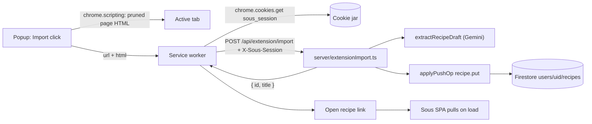

# Chrome extension: import the page you are reading

A Chrome extension that takes the recipe page in the active tab and puts it in
the signed-in Sous library, without opening the app. The popup is one button, a
spinner, a success or failure line, and a link to the saved recipe.

This slice **deploys nothing**. It adds a route and an unpacked extension, both
exercised against `localhost`. The extension only reaches production after a
later, separately-approved deploy, which `AGENTS.md` blocks until steps 18–19
(`photos-and-deploy-docs.md`, not yet in the repo) land.

## Goal

- Reading a recipe on any site, click the toolbar icon, click **Import**, and a
  few seconds later the popup offers **Open recipe** — a link to that recipe in
  the library, already saved to the account on the server.
- The recipe arrives on every signed-in device the ordinary way: it is written
  to Firestore under the session's `sub`, and each device picks it up on its
  next pull. No new sync path, no push from the extension.
- Signed out in the browser ⇒ the popup says so and links to sign-in. It never
  silently drops an import.

## Why a new server route

`POST /api/import` only **extracts**. It returns `{ recipe }` and persists
nothing; saving is entirely client-side (`recipeStore.create()` writes Dexie and
enqueues `recipe.put`, which `syncEngine` drains to `/api/sync/push`). An
extension that reused `/api/import` alone would extract a recipe and then have
nowhere to put it.

The two alternatives to a new route were considered and rejected:

- **Extension pushes to `/api/sync/push` itself.** It would have to reproduce
  `compactRecipe`, id/timestamp assignment and `normalizeRecipeDraft` in
  extension JS, where nothing type-checks it and nothing keeps it in step with
  `src/lib/`. Two copies of the recipe shape is exactly the failure mode
  `AGENTS.md` warns about for `api/`.
- **Extension opens `/import` with the URL prefilled.** No server change, but
  the user still has to review and save in the app, which is not the feature.

So: `POST /api/extension/import` extracts **and** writes, reusing
`applyPushOp(uid, { kind: 'recipe.put', payload })` from `server/sync.ts` so
validation, LWW and `compactRecipeFields` keep their single home.



## Decisions (settled — do not reopen while implementing)

1. **Auth is the existing `sous_session` token, carried in a header, and only in
   a header.** The cookie is `HttpOnly; SameSite=Lax`, and whether Chrome
   attaches a Lax cookie to an extension-initiated request is a browser
   implementation detail this feature should not rest on. The service worker
   reads the cookie with `chrome.cookies.get` (it has the `cookies` permission
   and host permission for both origins) and sends it as `X-Sous-Session`. The
   route does **not** fall back to the cookie — a cookie fallback would
   contradict the design and make the route's auth story two stories. Every
   existing route stays cookie-only and is untouched.
2. **No new credential type.** No extension tokens, no second secret, nothing to
   revoke separately. Signing out of Sous in the browser disables the extension
   by construction.
3. **The extension sends the page it can already see.** Server-side fetching
   fails on the sites people actually cook from — Cloudflare interstitials,
   consent walls, anything behind a login. The tab already has the rendered DOM,
   so the popup grabs it on the Import click (`activeTab` user-gesture) and
   the worker POSTs `{ url, html }`. Empty html is an error; the server never
   fetches the URL. On a truly restricted page (`chrome://`, the Web Store)
   injection fails and the popup stops without POSTing. Amended by
   `docs/plans/import-blocked-fetch.md`.
4. **The page grabber does no recipe parsing.** It prunes the DOM (drops scripts
   that are not `ld+json`, styles, SVG, iframes, canvas) and returns HTML.
   `extractRecipeSource` in `api/import.ts` stays the only thing that knows what
   a `schema.org/Recipe` block looks like. When the pruned HTML is over the cap
   the grabber moves the `ld+json` blocks to the front before truncating — it
   reorders tags it does not interpret, so the parser still lives in one place.
5. **The target origin is discovered, dev is preferred, and preference is not
   commitment.** The worker collects the origins that have a `sous_session`
   cookie — `http://localhost:5173` first, then production — and tries them in
   that order, moving to the next only when the connection is refused. Any real
   HTTP response, 404 and 401 included, is final, and so is a timeout: a server
   that accepted the request may already have saved the recipe, and retrying
   elsewhere would import it twice.

   Dev-first is a safety property: production-first would make every local test
   either hit a 404 (the route is not deployed) or, once it is deployed, write
   into the real library — the same-account/same-`sub` footgun `AGENTS.md` calls
   out. But committing to the first origin with a cookie would be just as wrong
   in the other direction: the cookie lasts 90 days and is not port-scoped, so
   anyone who has ever signed in locally would keep silently posting production
   imports at a dev server that is not running. Falling through on a refused
   connection gives both: a running local server always answers first, and a
   dead one is skipped.

   Neither origin has a cookie ⇒ signed out. No options page.
6. **No review step.** The recipe is saved as extracted; the app is where you
   fix it. That is the whole point of a one-button popup.
7. **The work happens in the service worker, not the popup.** Popups die when
   they lose focus, and a Gemini extraction takes seconds. State lives in
   `chrome.storage.session` keyed by tab id, so closing and reopening the popup
   shows the run still in progress, or its result.

## Starting state (read, not assumed)

- `api/import.ts` holds `extractRecipeSource` (exported), `RECIPE_SCHEMA`, the
  page fetch, and the Gemini call, all inline in `POST`. `scripts/server.ts`
  already imports this file, so `server/` may import it too — the ban is on
  `api/` importing siblings, because Vercel transpiles each `api/` entrypoint in
  isolation.
- `server/session.ts` reads the token from the cookie only, then `verifySession`
  and `isAllowed`. `server/sync.ts` exposes `applyPushOp`, which validates via
  `validatePushOp` and writes through `putDoc`.
- `scripts/server.ts` matches routes by exact method + path from `apiRoutes`,
  and copies every response header except `content-length` and `set-cookie`.
- `src/screens/RecipeView.tsx` renders "Recipe not found." the moment
  `useRecipe(id)` resolves to `null` — which is what the extension's link would
  hit on a device that has not pulled yet.
- `src/lib/recipeShape.ts` cannot be reused server-side: the runtime image
  copies `dist`, `api`, `server` and `scripts`, never `src`.

## Steps

### 1. [core] `server/session.ts` — accept the token from a header

Factor the token-independent half of `readSession` into a private
`sessionFromToken(token: string | null): ReadSessionResult`, then:

- `readSession(req)` keeps its exact behaviour (cookie only).
- Add `export const SESSION_HEADER_NAME = 'x-sous-session'`.
- Add `readHeaderSession(req)` / `sessionFromHeader(req)`: the trimmed
  `X-Sous-Session` value, through the same `sessionFromToken`. **No cookie
  fallback** (Decision 1).

`sessionFromToken` must test `token === null` **before** `sessionSecret()`, or
the existing "absent when the secret is blank and no cookie" case in
`server/session.test.ts` flips from `absent` to `unusable`. The header read must
map an empty or whitespace-only value to `null` for the same reason.

`server/session.test.ts` gains: header token accepted; blank or whitespace
header is `absent`; a tampered header is `unusable`; a header token whose email
is not in `ALLOWED_EMAILS` is `unusable`; `sessionFrom` still ignores the header;
`sessionFromHeader` ignores a valid cookie.

### 2. [core] `api/import.ts` — export the fetch and the extraction

Behaviour-preserving refactor. Pull two functions out of `POST` and export them:

- `fetchPageHtml(rawUrl)` → `{ ok: true, html }` or `{ ok: false, status, error }`,
  carrying today's exact messages: "That does not look like a web address."
  (422), "Only http and https URLs are supported." (422), "Could not reach that
  URL." (422), "The site refused the request (N). Try pasting the recipe text
  instead." (422).
- `extractRecipeDraft(source)` → `{ ok: true, recipe }` or
  `{ ok: false, status, error }` with "Extraction failed — no structured
  result." (502) and "Couldn't find a recipe in that content." (422).

`POST` becomes a thin caller and keeps injecting `sourceUrl: body.url`.
`maxDuration = 60`, `RECIPE_SCHEMA`, the model resolution and the inline session
gate stay put — that gate is the copy `AGENTS.md` requires to stay in sync with
`server/session.ts`, and step 1 does not change what a valid cookie means.

### 3. [core] `server/recipeFromExtraction.ts` — draft to `recipe.put` payload

Pure, no I/O. Server-side counterpart of `normalizeRecipeDraft` in
`src/lib/recipeShape.ts`, which cannot be imported here (the image never copies
`src`).

```ts
export function recipePutFromExtraction(
  draft: unknown,
  options: { id: string; now: number; sourceUrl?: string },
): Record<string, unknown> | null
```

- Normalizes `ingredientSections` (drops non-objects, empty sections, items
  without an `item` string), `steps` (needs non-empty `text`), `tags` (trimmed,
  de-duplicated, order preserved), and the optional `description`, `notes`,
  `prepMinutes`, `cookMinutes`.
- `title` is the only unrecoverable field: blank or missing ⇒ `null`.
- `servings` that is missing, non-finite or `< 1` becomes `1`. There is no
  review step, and the app's serving scaler needs a usable base; the user can
  fix it in the editor.
- Emits exactly the keys `compactRecipeFields` keeps, so `validateRecipePut`
  passes.
- Returns `null` when `JSON.stringify(payload).length` reaches 200 000 — the
  same `>=` comparison on UTF-16 code units that `validateRecipePut` applies —
  rather than letting the route get a silent `reason: 'invalid'` back from the
  push layer.

New `server/recipeFromExtraction.test.ts` covers each of those.

### 4. [core] `server/extensionImport.ts` — the route

`POST /api/extension/import`, body `{ url: string, html: string }`. `html`
must be non-blank; there is no server-side fetch fallback.

1. `sessionFromHeader(req)`; null ⇒ 401 `{ error: 'Unauthorized' }`.
2. Reject a body over `MAX_BODY_CHARS = 1_500_000` or `html` over
   `MAX_HTML_CHARS = 600_000`, both 413 with the same "Page was too large to
   import." so one condition never tells the popup two stories. The extension
   caps at 400 000 chars, which stays inside the body cap even for
   JSON-escaped non-ASCII, and `MAX_SOURCE_CHARS` in `api/import.ts` is 60 000
   anyway — these caps exist so the server is never the thing that runs out of
   memory. Like `syncPush`'s `MAX_PUSH_BYTES`, the measurement is `raw.length`
   after buffering, hence the `_CHARS` name.
3. A body that fails `req.text()` or `JSON.parse` is 400 JSON, as `syncPush`
   does — otherwise a hand-rolled curl during verification gets the dispatcher's
   `text/plain` "Internal error". `url` must parse as `http:`/`https:` —
   otherwise 422 with the same wording `/api/import` uses. That check belongs
   in the route because `sourceUrl` is stored on the recipe and this route
   never fetches.
4. `html` missing, empty, or whitespace ⇒ 422 "Could not read that page."
   Non-blank `html` ⇒ `extractRecipeSource(html)`. Empty source after extract
   ⇒ the same 422. The route does not call `fetchPageHtml`.
5. `extractRecipeDraft(source)`; a failure is returned verbatim (status and
   message), so the popup shows the same words the app's import screen would.
6. `recipePutFromExtraction(recipe, { id: randomUUID(), now: Date.now(), sourceUrl: url })`;
   `null` ⇒ 502 "Extraction produced an unusable recipe."
7. `applyPushOp(uid, { kind: 'recipe.put', payload })` **inside `try`/`catch`** —
   a Firestore failure is the likeliest failure in dev, and letting it reach the
   dispatcher returns a `text/plain` "Internal error" that the popup's
   `response.json()` would choke on. Throw or not-applied ⇒ 500 JSON "Could not
   save the recipe."
8. 200 `{ id, title }`. The extension builds the link from its own target
   origin, so a wrong `PUBLIC_ORIGIN` cannot produce a dead link.

All responses carry `Cache-Control: no-store`.

CORS: MV3 service-worker fetches covered by `host_permissions` are exempt from
CORS, so in the happy path none of this is exercised. It is still implemented,
narrowly, so a Chrome behaviour change cannot silently break the feature: a pure
`isExtensionOrigin(origin)` (`chrome-extension://` + 32 lowercase letters a–p)
gates an `OPTIONS` handler and an echoed `Access-Control-Allow-Origin` on the
POST response. `Access-Control-Allow-Headers: content-type, x-sous-session`,
`Access-Control-Allow-Methods: POST`, **no** `Allow-Credentials`: a credentialed
cross-origin request therefore fails outright, and a page that tries a simple
POST sends no cookie (`SameSite=Lax`) and cannot set the header.
`isExtensionOrigin` is unit-tested.

### 5. [core] Register the routes

Add `POST /api/extension/import` and `OPTIONS /api/extension/import` to
`apiRoutes` in `scripts/server.ts`. Nothing else in the dispatcher changes;
`dev:api` must be restarted after this (it does not watch `server/`).

### 6. [core] `extension/` — manifest, worker, page grabber

Plain MV3 JavaScript, no build step, no bundler, so `tsc -b`, `vite build` and
the Docker image are untouched. No `*.test.js` goes in here — vitest's default
include would pick it up, and `AGENTS.md` keeps unit tests on pure logic.

- `manifest.json`: MV3; `permissions: ["cookies", "scripting", "activeTab", "storage"]`;
  `host_permissions` for `https://sous.kyrylo.lol/*` and `http://localhost/*`.
  The localhost pattern is port-wide because `chrome.cookies.get` has to match
  it and cookies are not port-scoped; the API call itself still goes to the
  canonical dev port 5173. That is a real scope increase over a pinned port —
  it grants cookie access to anything else served from localhost — bounded by
  only ever reading `sous_session`. Deliberately **not** `<all_urls>`:
  `activeTab` grants access to the page only after the user opens the popup
  on it.
- `background.js` (module service worker):
  - `resolveTargets()` — the origins that have a `sous_session` cookie, localhost
    before production; empty means signed out. `runImport` walks the list and
    moves on only when `fetch` rejects (Decision 5). The `origin` stored in the
    state is the one that actually answered, not the first candidate, so the
    **Open recipe** link cannot point at a server that never saw the recipe.
  - The **popup** injects the grabber on the Import click with
    `chrome.scripting.executeScript({ target, func, args })` — that is the
    `activeTab` user-gesture — then messages `{ type: 'import', tabId, url,
    html }` to the worker. `func` is used rather than `files`: returning a
    value is documented for `func`, whereas a `files` injection returns the
    script's completion value and a second injection into the same document
    throws on top-level redeclaration — which is precisely the **Try again**
    path. Injection failure or empty html is an error in the popup; it does
    not POST.
  - `runImport(tabId, url, html)` POSTs that body and writes
    `{ phase, startedAt, recipeId, title, origin, message }` to
    `chrome.storage.session` under `state:<tabId>`. It does not inject.
  - A 90 s `AbortController` bounds the request, and a 20 s
    `chrome.runtime.getPlatformInfo()` tick keeps the worker alive while a
    request is in flight, since MV3 idles workers out at 30 s. `startedAt` lets
    the popup treat a `working` state older than two minutes as failed, so a
    worker killed mid-run cannot leave a spinner up forever.
- `extract-page.js`: exports the function that is serialized into the page with
  `toString()`, so it must close over nothing and **every helper must be nested
  inside it** — a module-level helper becomes a `ReferenceError` in the page.
  The cap arrives through `args`. Clones the document, removes `script` (except
  `application/ld+json`), `style`, `noscript`, `svg`, `iframe`, `canvas`, and
  returns `{ url: location.href, html }` with `html` capped at 400 000 chars.
  Over the cap, the `ld+json` blocks are moved ahead of the truncation point
  **in their original relative order** — `extractRecipeSource` returns the first
  `Recipe` node it finds, so a reordered hoist could select a different recipe.
  A block that truncation cuts in half simply fails the closing-`</script>`
  match and the run degrades to the stripped-text path; that is intended, and is
  not a reason to start parsing in the grabber.

### 7. [ui] `extension/popup.*` — the whole UI

`popup.html`, `popup.css`, `popup.js`. One 320px-wide card on the app's dark
palette (`#1c1917` background, the same accent as `theme_color`):

- **Signed out** — "Sign in to Sous to import." plus an anchor that opens Sous
  in a new tab (an anchor, not a scripted button, so it behaves like a link).
- **Idle** — the page title, and a primary **Import to Sous** button.
- **Working** — the button is replaced by a spinner and "Reading the recipe…",
  matching the app's import copy. Reopening the popup mid-run shows this.
- **Done** — "Saved to your library." and an **Open recipe** link to
  `${origin}/recipe/${id}`, which opens in a new tab.
- **Error** — the server's message in the app's danger style, plus **Try again**.

State comes from `chrome.storage.session` and a `chrome.storage.onChanged`
subscription; the popup never POSTs (the worker does). Spinner honours
`prefers-reduced-motion`, the status line is an `aria-live="polite"` region, and
the button keeps a visible focus ring.

### 8. [ui] `src/screens/RecipeView.tsx` — do not cry "not found" during a pull

The extension's link is the first thing a device sees of a recipe it has never
pulled, and today that renders "Recipe not found." until the pull lands.

The neutral state is driven by **local component state, not
`useSyncStatus()`**. The global status starts at `'idle'` and only becomes
`'syncing'` several awaits into `runSyncInner` — and never at all when the Dexie
lease is held elsewhere — so gating on it would flash not-found first, and could
strand a genuinely missing id behind an unrelated long pull.

The flag is inverted — `settled`, starting `false` — rather than a `looking`
flag turned on inside the effect. Effects run after commit, so a `looking`
variant still paints not-found for one frame, and `StrictMode` (on in
`src/main.tsx`) double-invokes effects, where a "once per mounted id" ref guard
can let the second invocation skip setting the flag that the first already
cleared. With `settled`, the neutral state is the initial state and nothing can
flash.

So: in an effect placed **above** the existing early returns (hook order),
return early unless `recipe === null`, then fire `sync()` once per id and record
the settled id in its `finally`. The gate matters: an ungated effect would sync
on every recipe open, which is not one of the triggers `AGENTS.md` lists, and
would toast "Synced" on a screen where the user did nothing. `settled` is held
as the id it settled for, not a boolean, because React Router reuses the element
across a `:id` change. Render "Looking for this recipe…" while
`recipe === null && settledId !== id`; otherwise the existing not-found message. Signed-out and offline resolve quickly, so they still reach
not-found. Calling `sync()` from a screen is the pattern `Settings` already
uses, so the "screens must not fetch" rule is respected.

Joining a `sync()` that was already in flight can settle without having pulled
this recipe, which lands on not-found. That self-heals — `useRecipe` is a
`useLiveQuery`, so the next pull re-renders with the recipe — and is not a
reason to add a retry loop.

### 9. [core] Housekeeping

- `extension` added to `.dockerignore` and `.gcloudignore`. Hygiene only — the
  runtime stage never copies it.
- `README.md`: loading it unpacked **against localhost**, the permissions and
  why each one is needed, and the fact that the production half waits on a
  deploy this slice does not perform.
- `AGENTS.md`: the new route, the header-auth exception, the `extension/`
  directory, and a **row in the Plans table** marking this plan's production
  half as blocked behind steps 18–19.
- Note for the step 19 legal rewrite: rendered page HTML — possibly from a page
  behind a login — is now sent to Gemini. That data flow is new and the privacy
  copy has to name it.

## Verification

`.env.local` in this workspace is populated with real values (checked by key
name and value length only; never printed). There are no gcloud credentials and
`gcloud` is not installed.

- `npx tsc -b` and `npm test`.
- **Prerequisite step:** install and start the Firestore emulator
  (`npx firebase-tools emulators:start --only firestore`; Java is present,
  egress is open) and export `FIRESTORE_EMULATOR_HOST` **before** starting
  `dev:api`, so a Firestore call cannot reach the production project. The
  emulator is the opt-out `AGENTS.md` sanctions; production ADC is deliberately
  not used, because the same Google account means the same `sub` and the write
  would land in the real library.
- The test session is a `sous_session` cookie forged with the local
  `SESSION_SECRET` for an address in the local `ALLOWED_EMAILS`, scripted so no
  secret is printed. No Google sign-in needed.
- HTTP smoke test against `dev:api`: 401 with no header, 401 with a tampered
  header, 413 on an oversized page, 422 on a non-http URL, and a 200 whose `id`
  then appears in the emulator and in a `/api/sync/pull` response. Same token,
  two carriers: the extension route reads the header, and `/api/sync/pull` is
  cookie-only and untouched, so the script must send it as a cookie there.
- Manual: Chrome with the extension loaded unpacked against `localhost:5173`,
  recorded, covering signed-out, working, error and success states, and the
  **Open recipe** link landing on the recipe in the app.
- Because `GEMINI_API_KEY` is populated, the extraction runs for real against a
  real recipe page. No stub is used; if that changes, it is named in the
  walkthrough rather than passed off as an end-to-end pass.

## Non-goals

- No dedupe: importing the same URL twice makes two recipes.
- No photo import; the recipe's image is not fetched. (`photo.put` still has no
  endpoint.)
- No Firefox/Safari port, no Web Store packaging, no pinned extension `key`.
- No deploy. No change to `vercel.json`, the `api/` copies' session gate, the
  Dexie schema, the sync wire contract, or the chat framing.
