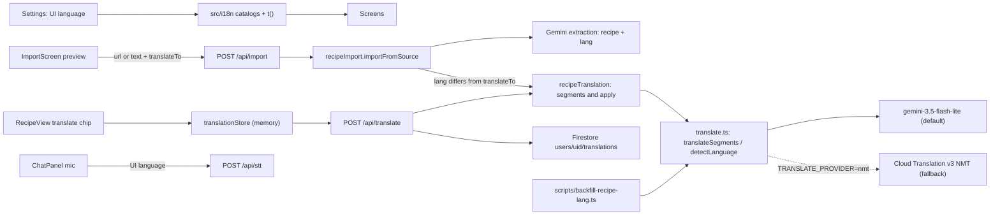

# Internationalization: UI language, recipe language, and translation

Status: proposed, not audited. Work happens on the branch
`cursor/i18n-plan-1e8f`; see [Branch and review](#branch-and-review).

The rules for this feature are in the
[i18n constitution](i18n-constitution.md) (moved to `src/i18n/AGENTS.md` in
step 1). This plan must stay consistent with it. Where they disagree, the
constitution wins until it is amended through its own protocol.

## Problem

Sous is English-only. All UI copy is inline English across about 400 strings
in `src/screens/`, `src/components/`, and a few `src/lib/` modules. Some server
routes (`server/importRoute.ts`, `server/stt.ts`, `server/admin.ts`) return
English error text that the client shows as-is. Relative times
(`src/lib/relativeTime.ts`), plurals ("1 serving" / "2 servings"), and unit
names (`src/lib/units.ts`) are English string templates. Dictation
(`server/stt.ts`) tells Gemini `Language: English.`

Recipes are a separate problem. Import keeps the source wording ("faithful to
the original"), so the library already mixes languages: an Italian recipe
stays Italian. Switching the UI to Ukrainian would still leave a Ukrainian
reader with an Italian recipe. The app records nothing about what language a
recipe is in, so it can't know when translation is needed.

## Goals

- A **UI language** setting in Settings with four presets: English (`en`),
  Ukrainian (`uk`), Russian (`ru`), and Mandarin as Simplified Chinese
  (`zh-Hans`). Changing it switches all app copy right away, with correct
  plurals and number/time formatting.
- Every recipe can carry a **language label** (`Recipe.lang`, a canonical
  BCP 47 tag): from import, from the author's UI language for hand-made
  recipes, or detected. The label can be corrected in the recipe form.
- **Guessed language at import.** Every single-recipe import preview says
  which language the recipe seems to be in and lets the person change it
  before saving. This is most prominent for pasted text.
- **Translate on import.** When an imported recipe's language differs from
  the UI language, the preview shows "Translate into <UI language>", checked
  by default. Unchecking it keeps the original. Bulk import gets one
  checkbox for the batch.
- **On-demand translation on the recipe screen.** For recipes in another
  language, one toggle on the meta line translates the whole recipe; a second
  tap returns to the original. Nothing is translated until the person asks.
- Translation is fast enough (a few seconds for a whole recipe), cheap (about
  $0.002 per recipe), and uses the existing Gemini API key by default.
- Translation takes as little screen space as possible: no per-line controls
  on ingredient or step rows.
- **Dictation** (`/api/stt`) transcribes in the UI language. If testing shows
  poor results for a language, dictation falls back to English and the mic
  says so.
- **New UI text stays translated.** A root `AGENTS.md` rule requires every
  future change that adds or changes UI text to add it to every catalog and
  to pass an **in-context translation review**. The review takes screenshots
  of each affected screen in every language and has an LLM judge whether the
  translated strings make sense together on that page. This branch delivers
  the review as Cursor instructions (a project skill). A standalone,
  IDE-independent suite is an
  [upcoming milestone](#upcoming-milestone-standalone-i18n-review-suite).

## Non-goals

- Translating the library ahead of time or in the background, including
  Library card titles and search.
- Storing runtime (recipe-screen) translations as recipe edits. Only import
  can save translated text, and only when the person leaves the box checked.
- Translating `/about`, `/privacy`, and `/terms`. They stay English; only the
  links to them are translated.
- The Chrome extension (`extension/`): import translation and popup copy are
  the [upcoming milestone](#upcoming-milestone-chrome-extension), on a
  separate branch. This branch only makes the server ready for it.
- The owner notification email and server-rendered access/invite HTML.
- Right-to-left layout.
- Changing the chat request. Gemini already replies in the language the user
  writes in.
- Per-user cost metering for translation.
- The standalone i18n review suite (`npm run test:i18n`). This branch ships
  the Cursor-driven review only; the standalone suite is an
  [upcoming milestone](#upcoming-milestone-standalone-i18n-review-suite).
- Photo or handwriting OCR import. There is no photo import today (see
  [Design notes](#import-guessed-language-and-translate-on-import)).

## Language codes

Every stored or transmitted language is a **BCP 47** tag (constitution
principle 5):

- The primary subtag is the **ISO 639-1** language code: `en`, `uk`, `ru`,
  `zh`, `it`, `fr`.
- An **ISO 15924** script subtag is added only where the script changes the
  meaning: `zh-Hans` (Simplified), `zh-Hant` (Traditional).
- **Country codes are never language codes.** No `ua`, `cn`, `jp`, `gr`,
  `cz`, `dk`, `se`. Region subtags (`en-GB`) are not used either; they are
  stripped on normalization.
- **Normalization at every boundary** (model output, request bodies,
  backups, the form, the backfill script): `Intl.getCanonicalLocales` for
  canonical case, a small alias map for common mistakes (`ua`→`uk`, `cn`→`zh`,
  `jp`→`ja`, `gr`→`el`, `cz`→`cs`, `dk`→`da`, `se`→`sv`), then keep the
  language plus script only for `zh`. Tags that still fail to parse are
  dropped (the recipe is then unlabelled, which is always allowed).
- A bare `zh` from the model is stored as `zh`; comparison treats it as
  unknown script (see [Recipe language labels](#recipe-language-labels)).
- **Provider codes stay in the adapter.** Cloud Translation wants `zh-CN`
  for Simplified Chinese; that mapping exists only inside the NMT adapter and
  is never stored or returned.

**Why `uk`, not `ua`.** `uk` is the ISO 639-1 code for the Ukrainian
*language*. `ua` is the ISO 3166-1 code for the *country* Ukraine (as in the
`.ua` domain). Language tags use language codes, so Ukrainian is `uk`, just
as Chinese is `zh`, not `cn`. Browsers report `uk` / `uk-UA` in
`navigator.language`, and `Intl` APIs expect `uk`. The alias map accepts `ua`
as input so the mistake never breaks anything.

## Decisions and rejected alternatives

### One recipe-level toggle, not a button per line

The original idea was a small translate button next to each ingredient and
step. Rejected (constitution principle 3):

- In `src/screens/RecipeView.tsx`, every ingredient row is already a
  full-width `<button>` that checks it off, and every step row is one that
  advances cook mode. A button inside those rows is invalid HTML. It would
  take width on phones and invite accidental taps while cooking.
- Translating line by line costs one round trip per line, so 30 to 60 taps
  for one recipe.
- A single line loses context: "the dough", "it", or an ingredient named only
  in the list.
- A reader of a foreign recipe wants all of it translated.

Instead, the recipe's meta line ("Prep N min · Cook N min", around
`RecipeView.tsx` lines 128–131) gets one small chip. It reads "Italian ·
Translate", then shows a spinner, then "Translated from Italian · Original".

### Provider: Gemini Flash-Lite by default, Cloud Translation NMT as fallback

**Decision** (recorded in the constitution's Current decisions):
`gemini-3.5-flash-lite`, thinking level `minimal`, default temperature,
structured JSON output. Behind one interface in `server/translate.ts`
(`translateSegments`, `detectLanguage`), selected by env:
`TRANSLATE_PROVIDER` (`gemini` default, or `nmt`) and `TRANSLATE_MODEL` for
Gemini.

**Re-evaluation.** An earlier draft argued against Cloud Translation NMT
partly because it needs the API enabled and an IAM role, and listed "no new
vendor, secret, or IAM change" under *Risk*. That was mislabeled: it is a
benefit (operational simplicity), and a minor one, because NMT's setup is a
one-time `gcloud services enable` plus one role binding (see
[Appendix](#appendix-nmt-one-time-setup-owner)). So the real question is
whether NMT's lack of recipe context alone justifies defaulting to Gemini.

On its own, context would be a weak reason if latency dominated. Here it
doesn't, and context matters more than usual:

1. **Context is a correctness issue for `uk` and `ru`.** Pronouns and
   past-tense verbs agree in grammatical gender with a noun named earlier,
   often in an earlier step or only in the ingredient list ("Add it and stir
   until it thickens" where "it" is the feminine *сметана* or the masculine
   *соус*). NMT translates essentially sentence by sentence, even in HTML
   mode with the whole recipe in one request, so it guesses gender at exactly
   these points. One Gemini call sees the whole recipe.
2. **Latency is mostly hidden.** Translate-on-import is on by default, so
   most foreign recipes are translated at import, where a few seconds are
   already expected. The runtime toggle mostly serves recipes imported
   before this feature and UI-language switches.
3. **Cost.** NMT is free up to 500k characters a month, then about $20 per
   1M characters, about $0.05 per 2,500-character recipe. Gemini is about
   $0.002 per recipe, roughly 25 times cheaper beyond the free tier. At this
   app's volume both are cents a month, so cost is a tiebreaker, not a
   driver.

NMT's real advantages are **latency** (about 0.2–0.4 s against an
estimated, unmeasured 2–7 s for a whole recipe on Gemini) and
**determinism** (exactly one output per input, so id mismatches can't
happen). Those are why it stays the documented fallback.

**Why `gemini-3.5-flash-lite`.** It is Google's current GA low-latency,
low-cost tier, lists translation as a target use, and supports structured
output. $0.30 per 1M input tokens and $2.50 per 1M output tokens.
Alternatives: `gemini-3.1-flash-lite` ($0.25 / $1.50) may shut down from
May 7, 2027; `gemini-2.5-flash-lite` is restricted to accounts that used it
before; the chat model `gemini-3.7-flash` costs 2.5 times as much (doubling
on January 1, 2027) and its lowest thinking level is `low`.

**Why thinking level `minimal`.** Translation gains nothing from multi-step
reasoning. Thinking tokens are billed as output and delay the first output
token. `minimal` is the lowest level on Gemini 3.x; it is not guaranteed to
be zero thinking. Temperature stays at the default, because Google's Gemini 3
guidance advises against lowering it.

**When to switch to NMT.** Either of:

- Step 14 measures p95 above about 4 s for the runtime toggle from Cloud Run
  `europe-west1`, after the Gemini adapter splits a recipe into two
  parallel requests (header plus ingredients, and steps; each sends the whole
  recipe as context and returns only its own ids).
- The translate eval finds quality problems NMT doesn't have.

Switching is `TRANSLATE_PROVIDER=nmt` plus the NMT adapter and the one-time
setup, and an update to the constitution's Current decisions (principle 11).

Other rejected options:

- **Cloud Translation LLM (Adaptive / TLLM).** About $10 per 1M characters in
  and out, and the documented region is `us-central1`.
- **DeepL.** A new vendor and secret, and about $26 a month on current plans.
- **Chrome's built-in `Translator` / `LanguageDetector`.** Not available on
  phones, Firefox, or Safari/iOS.
- **Extracting and translating in one import call.** The preview needs both
  the faithful original and the translation, the extraction model is the
  pricier chat model, and one call would double its output. Import makes a
  second, cheap translate call instead.

### `Recipe.lang` is a deliberate change to the schema lock

Root `AGENTS.md` says not to add fields to `Recipe`, and
`src/lib/recipeStore.test.ts` locks the key set. This plan lifts that lock for
one optional field, `lang?: string`, the way `galleryPhotoIds` was added
(constitution principle 7). Every place that strips unknown keys changes
together (step 6), and `AGENTS.md` records the exception.

Detecting the language at view time without a stored field was considered.
It was rejected in favour of a stored field the person can correct.

### Leave the chat request alone

`api/chat.ts`'s Gemini request shape is on the `AGENTS.md` do-not-touch list
(constitution principle 13). No locale is sent, and `api/chat.ts` does not
learn about `lang`. Only client-side chat copy (for example "Here is my
proposed change:") moves to the catalogs.

## Architecture

## Design notes

### UI copy

- **No i18n library.** A typed catalog per locale in `src/i18n/`, where
  `en.ts` defines the `Messages` type so TypeScript checks that every locale
  has every key.
  - `t(key, params)` handles text with named parameters. Plural keys select a
    form with `Intl.PluralRules`: `uk` and `ru` need `one` / `few` / `many` /
    `other`; Chinese needs only `other`.
  - `Intl.RelativeTimeFormat` replaces the English templates in
    `src/lib/relativeTime.ts`.
  - `Intl.NumberFormat` handles decimals. Unicode fractions like `½` stay.
  - `Intl.DisplayNames` gives language names ("Italian", "італійська") in the
    UI language.
  - About 400 strings in total, so all catalogs are bundled.
- **Language setting.** Stored as `cook.locale` in localStorage next to
  `cook.theme` (`src/lib/settings.ts`). It defaults to the browser language
  (`navigator.language`, normalized) if supported, otherwise `en`. The inline
  boot script in `index.html` sets `<html lang>` before first paint, like the
  theme. React re-renders on change through a small store read with
  `useSyncExternalStore`.
- **Units.** Stored unit names are English tokens (`src/lib/units.ts`). The
  catalogs map the known tokens to display labels for each language. Custom
  units go through translation.
- **Server error text.** Server JSON errors add a machine-readable `code`
  next to the existing English `error` (principle 10). The client maps codes
  to catalog text and falls back to `error`.

### Recipe language labels

- `lang` is optional and best-effort (principle 6). Code must work when it is
  missing or wrong.
- **Comparison.** "Needs translation" means the primary subtags differ. For
  Chinese the script matters: `zh-Hant` against `zh-Hans` counts as
  different, and a bare `zh` counts as unknown (neutral chip, detect on
  translate).
- **Sources.** Import (the extraction schema returns `lang`), the recipe
  form, the translate response's `detectedLang`, and the backfill script.
- **Hand-made recipes.** "New recipe" defaults `lang` to the UI language
  through `RecipeForm`'s language field.
- **Chat.** The `update_recipe` tool never sees `lang`. `applyDraft` carries
  `existing.lang`, like `sourceUrl`.
- **Detected but unlabelled.** When `/api/translate` detects the language of
  an unlabelled recipe, `translationStore` keeps `detectedLang` in memory
  only. It becomes the recipe's `lang` only on the next save the person
  starts from the edit form, which pre-fills the language field with it. See
  [Backfill analysis](#backfill-analysis) for why it is never written in the
  background.

### Translation layer (server)

- **`server/translate.ts`**: the provider interface and provider selection.
  - `translateSegments({ segments, target, sourceLang? })` returns
    `{ detectedLang, segments }`; `detectLanguage(text)` returns a tag or
    `null`.
  - The Gemini adapter: one structured call, output schema
    `{ detectedLang, segments: [{ id, text }] }`, thinking level `minimal`,
    `maxOutputTokens` sized to the caps. The prompt: translate cooking text,
    keep numbers, units and temperatures as written, don't convert units,
    keep dish names recognisable, and return exactly the ids given.
  - Output is validated: the same ids, once each, same order, non-empty
    strings. Anything else is an error; nothing is partly applied
    (principle 4).
  - Env is read per request (like `recipeImportDepsFromEnv`), using `||` not
    `??` so a bare `TRANSLATE_MODEL=` means the default.
- **`server/recipeTranslation.ts`**: pure helpers.
  - `recipeSegments(recipe)` returns ids and text for the title,
    description, notes, section names, each ingredient's `item` and `note`,
    custom (non-token) units, and each step.
  - `applyTranslation(recipe, segments)` returns a recipe with identical
    structure and translated text. Quantities, known unit tokens, order, and
    counts are unchanged, so servings scaling and cook-mode keys keep
    working.
  - It lives on the server because the server image cannot import from
    `src/` (the server already duplicates helpers, for example
    `compactGalleryPhotoIds` in `server/store.ts`). It keeps its own copy of
    the known unit tokens; a test asserts it matches `src/lib/units.ts`.
- **`POST /api/translate`** (`server/translateRoute.ts`, registered in
  `scripts/server.ts`).
  - `requireMember` (401 means denied, 503 means unknown). A missing
    `GEMINI_API_KEY` (Gemini provider) returns 503, a bad body 400, over the
    caps (about 200 segments, 20k characters) 413, and a provider failure or
    mismatched output 502. Every error carries a `code`.
  - Body: `{ recipeId?, target, sourceLang?, recipe }`, where `recipe` holds
    only the translatable fields and structure (validated and compacted like
    `server/store.ts` does), and `target` must be a supported UI language.
  - Response: `{ detectedLang, recipe }`, a display-only recipe with identical
    structure.
  - `recipeId` is optional. With it, the server cache is used; without it
    (the import preview after the person corrects the language), nothing is
    cached.
  - **Server cache**: `users/{uid}/translations/{recipeId}.{target}` stores
    `{ hash, segments, detectedLang, provider, model, createdAt }`. `hash` is a
    SHA-256 of the source segments plus a `TRANSLATION_VERSION` constant that
    is bumped when the prompt or provider changes. A hit skips the provider.
    It is derived data outside sync, so there are no tombstones or push
    kinds; orphans left by deleted recipes are harmless (principle 7).
- **Client** (`src/lib/translateApi.ts`, like `sttApi.ts`; a 401 calls
  `invalidateSession()`). `src/lib/translationStore.ts` keeps an in-memory
  Map keyed by recipe id, target, and `updatedAt` (any edit bumps it), plus
  the per-recipe toggle state so cook mode and back keep the translated
  view. Nothing is stored on the device (principle 8).

### Recipe screen toggle

- The chip sits on the meta line; if the recipe has no prep or cook time, the
  meta line still renders for the chip.
- States: labelled and different ("Italian · Translate"), unlabelled (muted
  "Translate"), loading (spinner), translated ("Translated from Italian ·
  Original"), error ("Couldn't translate · Retry"). Hidden when `lang`, or
  the in-memory `detectedLang`, matches the UI language.
- If the response's `detectedLang` matches the UI language, the view stays on
  the original, the chip hides, and a short notice says the recipe is already
  in that language.
- The edit form and chat always work on the original. If the recipe changes
  while translated, the view returns to the original and the chip goes idle;
  the person taps again (principle 2).

### Import: guessed language and translate-on-import

**"Handwritten" import** means a recipe pasted or typed as text into
`/import`. There is no photo or OCR import, and this plan doesn't add one.

- **Server pipeline** (`server/recipeImport.ts`). `RecipeImportDeps` gains a
  `translator` (the `server/translate.ts` interface), and `importFromSource`
  takes an optional `translateTo`.
  - The extraction call is unchanged in model and prompt except that
    `RECIPE_SCHEMA` gains `lang` (the source's language as a BCP 47 tag), and
    `normalizeImportedRecipe` normalizes it. The text stays faithful to the
    source.
  - If `translateTo` is set and the extracted `lang` differs from it (by the
    comparison rule), the pipeline builds segments with
    `server/recipeTranslation.ts`, calls `translateSegments`, and applies them.
  - The `ok` outcome becomes `{ kind: 'ok', recipe, translation? }` where
    `translation` is `{ kind: 'ok', lang, recipe }` or `{ kind: 'failed' }`.
    Translation failure (provider error, caps, mismatched ids) **never** fails
    the import (principle 12).
  - Import translations are not cached: the recipe has no id yet, and a saved
    translated recipe is already in the UI language.
- **`POST /api/import`** body gains optional `translateTo` (a supported UI
  language; anything else is 400). The response is
  `{ recipe, translation?: { lang, recipe }, translationFailed?: true }`.
  Import latency grows by one translate call only when translation runs.
- **`POST /api/extension/import`** accepts the same optional `translateTo`.
  When translation succeeds it saves the translated recipe with `lang` set to
  `translateTo`; on failure it saves the original. The response adds
  `translated: boolean`. Today's extension ignores it, so the extension
  milestone needs only client changes.
- **Preview** (`src/screens/ImportScreen.tsx`, the `CreateRecipeForm` under
  "Anything the extraction got wrong, fix it here before saving."):
  - A compact line: "Looks like Italian. Change it if that's wrong." with a
    language select (names from `Intl.DisplayNames`; the four UI languages
    first, then common recipe languages). It edits the draft's `lang`. It
    shows on every single-recipe preview and is emphasized (notice styling)
    for pasted text, where the guess has less to go on.
  - Below it, when the guessed language differs from the UI language:
    "Translate into Ukrainian", checked by default. The client holds both
    versions, so toggling swaps the form's content instantly. If the form has
    edits, toggling first asks to confirm discarding them.
  - Changing the guess to the UI language hides the checkbox and shows the
    original. Changing it from the UI language to another language shows the
    checkbox; if no translation is held, checking it calls `/api/translate`
    without a `recipeId`.
  - If `translationFailed`, the preview shows the original with a notice
    ("Couldn't translate this recipe. You can save the original.") and no
    checkbox.
  - **Saving translated** stores the translated text with `lang` = UI
    language. The original text is not kept; `sourceUrl` remains the link
    back. **Saving untranslated** stores the original with `lang` = the
    guessed (possibly corrected) language.
- **Bulk import** (URL-only, no preview): one "Translate into <UI
  language>" checkbox for the batch, checked by default. Each URL sends
  `translateTo` when it is checked. A failed translation saves the original
  and the summary marks that row "saved untranslated".

### Dictation

`server/stt.ts` builds its prompt with `Language: English.` Gemini audio
understanding is multilingual, so switching language is mainly a prompt
parameter. `/api/stt` accepts an optional supported UI language (missing
means English, for old clients; unsupported is 400 with a `code`) and names
that language in the prompt. `sttApi.ts` sends the UI language.

Fallback: if manual testing in step 4 shows poor `uk`, `ru`, or `zh-Hans`
transcription, those languages ship English-only as a fast-follow. The client
then sends `en` for them, and the mic in `src/components/ChatPanel.tsx` shows
a small "EN" badge with tooltip and aria text "Dictation understands English
only for now". The result is recorded in the constitution's Current
decisions.

### In-context translation review

Catalog parity tests prove every key exists in every language. They can't
show whether the strings work together on a screen. Examples: a menu that
mixes a verb ("Save") with a noun for the same action, a Russian label that
doesn't agree with the number next to it, a Chinese button that wraps
mid-word, or two screens that use different words for "collection". The
review catches these by looking at the rendered page.

**What the review does.** For each screen state in the manifest and each
non-English language:

1. Render the screen at phone width (390×844) and capture it, together with
   the English version of the same state as reference.
2. Give both screenshots, the language, and the rubric to a vision-capable
   LLM reviewer.
3. Get back pass/fail and a list of issues. Each issue names the visible
   text, the problem, a suggested fix, and severity (`blocker` or `nit`).
4. Fix blockers in the catalogs, then re-review the affected screens.
   Record nits in the report or fix them.

**Rubric.** Recipe content (titles, ingredients, steps) is excluded; a
recipe in another language is expected. The reviewer judges only the app's
own text:

- **Sense in context.** Labels read as one coherent menu, form, or dialog.
  Each word is the right sense for its control, for example a verb on an
  action button, not a noun.
- **Consistent terms.** The same concept uses the same word everywhere on
  the page, and matches the glossary in the constitution's Current decisions.
- **Grammar across strings.** Case and gender agreement between neighbouring
  strings and with numbers (`uk`, `ru`), and correct plural forms.
- **Register.** Formal or informal address matches the decision recorded in
  the constitution.
- **Nothing left in English.** No untranslated or mixed-language app text.
- **Layout.** No truncation, overflow, clipped buttons, or bad line breaks.
  Russian runs long, and Chinese breaks lines differently.

**Screen manifest.** `.cursor/skills/i18n-visual-review/screens.json` lists
every screen state to capture. Each entry has an id, a route, a
plain-language setup (for example "Library with at least one named
collection" or "Import preview for a foreign URL with the translate
checkbox on"), and whether it needs sample data. It is JSON so the
standalone suite can reuse it. It covers:

- Library (empty and populated), Settings, Admin
- Import (idle, bulk, preview with the guessed-language line and translate
  checkbox, and the failure notice)
- RecipeView (normal, cook mode, translated, chip states), RecipeEdit, and
  the chat panel
- the sheets and toasts

**Cursor delivery (this branch).** A project skill at
`.cursor/skills/i18n-visual-review/SKILL.md` tells an agent to:

- check that Vite and `dev:api` are both running, signed in at
  `http://localhost:5173`
- switch languages through the Settings picker, or set `cook.locale` and
  reload
- capture each manifest state per language, in a browser session (for a
  cloud agent, the `computerUse` subagent)
- review each screenshot pair against the rubric, either itself or through
  a subagent given the images as file attachments
- write a report to `/opt/cursor/artifacts/i18n-review/<date>.md` with a
  pass/fail table (screen × language), issues with screenshot paths, and
  what was fixed

It also covers two scopes:

- **Scoped run.** Only the screens that show new or changed keys, in all
  three non-English languages. Required for any UI text change.
- **Full run.** Every manifest state in every language. Required at this
  plan's verification and whenever a supported language is added.

It must not create, edit, or delete library data beyond what a screen
state needs. Local dev talks to production Firestore, so the skill
prefers existing recipes and clearly named throwaway ones that it deletes
afterwards.

**Why a skill first.** It needs no new dependency, and it reuses the browser
tooling agents already have. It also lets the rubric and manifest settle
before anyone writes code against them.

## Backfill analysis

Should existing recipes get a `lang` label, and how?

- **Not required for correctness.** The missing-`lang` fallback is permanent
  anyway (principle 6): an installed PWA still running old code strips
  unknown keys when it edits a recipe, old backups have no label, and
  detection can be wrong. Every code path must handle "unlabelled" whether or
  not a backfill runs.
- **A lazy write-back from the client is ruled out.** `recipeStore.save` sets
  `updatedAt: Date.now()` (`src/lib/recipeStore.ts`, around line 81), and the
  Library sorts by `updatedAt` descending (`src/lib/libraryMemory.ts`,
  `listRecipes`, around line 194). A background label write would make every
  translated recipe jump to the top of the Library. So a detected language
  stays in memory and is persisted only on the next save the person starts.
- **A one-off owner-run script is worth it.** Labelling the existing library
  removes the "unknown" state, so the chip shows a definite "Italian ·
  Translate" instead of a muted guess, and the language-aware features that
  may follow (Library language badges or filters, the extension milestone)
  start from complete data. The cost is trivial: one detection call per
  unlabelled recipe.

**`scripts/backfill-recipe-lang.ts`** (step 15):

- Run by the owner as
  `node --env-file=.env.local scripts/backfill-recipe-lang.ts [--write]`
  with local ADC. It is **dry-run by default**: it logs counts (scanned,
  unlabelled, detected per language, undetectable) and writes nothing
  without `--write`.
- It reads live recipe docs (not tombstones) under `users/*/recipes` that
  lack `lang`, detects with the translator interface's `detectLanguage` on
  the title, description and first steps, and normalizes the tag.
- It writes **only** `lang` and a new `serverUpdatedAt`, in a transaction
  that re-reads the doc and skips it if `updatedAt` changed or `lang` appeared.
  It never touches text and keeps `updatedAt`, so it never wins
  last-write-wins against a real edit and never reorders the Library.
- Bumping `serverUpdatedAt` keeps the doc consistent with pull ordering (the
  server paginates pulls by `serverUpdatedAt`). Clients re-pull the whole
  library on each sync (`pullAll` in `src/lib/syncEngine.ts` starts from an
  empty cursor and replaces the in-memory library), so devices see the label
  on their next pull.
- A concurrent edit from a device that pulled before the backfill pushes a
  recipe without `lang`. `compareMutation` in `server/store.ts` allows a put
  when the client's `updatedAt` is at least the stored one, so the label is
  dropped again. The fallback handles that; nothing breaks.
- **Order.** Run only after the lang-aware server and client are deployed to
  production and installed PWAs have updated. Dev talks to real Firestore, so
  even a local run mutates production data. The owner runs it explicitly;
  no agent runs it with `--write`.

## Steps

Each step names its owner tag. Commit and push after each step.

1. **[core] i18n foundation, constitution, and AGENTS.md pointer.**
   - Add `src/i18n/` catalogs (`en`, `uk`, `ru`, `zh-Hans`), `t()`, plural
     selection, the locale store, and the language-tag helpers
     (`normalizeLang` with the alias map, `sameLanguage` comparison, the
     supported list).
   - Add `getLocale` / `setLocale` to `src/lib/settings.ts`; have the
     `index.html` boot script set `<html lang>`.
   - Rewrite `relativeTime.ts` on `Intl.RelativeTimeFormat`, and make
     quantity decimals locale-aware.
   - `git mv docs/plans/i18n-constitution.md src/i18n/AGENTS.md`, delete its
     draft-location note, and update links to it (including this plan's).
   - Root `AGENTS.md`: add a line saying changes touching UI copy,
     `Recipe.lang`, translation, import translation, or dictation language
     must follow `src/i18n/AGENTS.md`; add rows to the Plans table for
     `docs/plans/i18n.md` and the constitution's location.
   - Root `AGENTS.md`, first part of the **UI text rule**: any change that
     adds or changes user-facing text must put it in the `src/i18n/`
     catalogs for every supported language, with no hardcoded strings.
     Step 2a adds the second part.
   - Record the register and glossary in the constitution's Current
     decisions: `uk` "ви", `ru` "вы", `zh-Hans` "你", and a short glossary
     of core terms (recipe, collection, library, import, servings, step,
     ingredient) for each language.
   - Tests: catalog parity, plural coverage for `uk` and `ru`, tag
     normalization (`ua`→`uk`, `zh-cn` handling, region stripping, garbage
     dropped).
2. **[ui] Move copy to catalogs.** Move all copy in `src/screens/`,
   `src/components/`, `SyncToast`/`syncEngine` messages, and client error
   strings to `t()`. Add a language picker in Settings next to Appearance,
   and localize unit labels in `RecipeForm` and `RecipeView`.

   **2a. [core] In-context translation review (Cursor skill) and the UI text
   rule.** A separate step (and delegation) that runs right after step 2, so
   every later `[ui]` step can use it.
   - Write `.cursor/skills/i18n-visual-review/SKILL.md` and `screens.json`
     as described in
     [In-context translation review](#in-context-translation-review). Add
     manifest entries for states that later steps create (the translate
     chip, the import preview additions) as those steps land.
   - Root `AGENTS.md`, second part of the **UI text rule**:

     > Any UI change that adds or changes user-facing text must (1) add it
     > to every catalog in `src/i18n/` (see `src/i18n/AGENTS.md`), and (2)
     > run the in-context translation review in
     > `.cursor/skills/i18n-visual-review/SKILL.md` for every screen that
     > shows the new text, in every non-English language. Blockers are
     > fixed before the change is done, and the report is attached. New
     > screens or states are added to `screens.json`.
   - Do a full run on step 2's output and fix the blockers it finds. This
     is the first real use of the skill; tune the rubric and manifest if it
     produces noise.
   - From here on, each `[ui]` step (5, 9, 10, 12) ends with a scoped run.
3. **[core] Server error codes.** Add `code` fields to JSON errors from
   import, extension import, stt, and admin, and map them on the client in
   `importApi.ts`, `sttApi.ts`, and `adminApi.ts`. The English `error` stays
   as a fallback.
4. **[core] Dictation language.** `server/stt.ts` accepts a supported
   language and builds the transcription prompt from it instead of
   `Language: English.`. Test by hand with short clips in each language; if
   any language is poor, record the English-only fallback for it in the
   constitution's Current decisions.
5. **[ui] Dictation client.** `sttApi.ts` sends the UI language (or `en` for
   any language step 4 fell back on). Only if step 4 fell back: the "EN"
   badge and "Dictation understands English only for now" tooltip/aria text
   on the mic in `ChatPanel.tsx`.
6. **[core] `Recipe.lang`.** Add optional `lang` to:
   - `src/lib/types.ts`
   - `src/lib/compactRecipe.ts`
   - `compactRecipeFields` and payload validation in `server/store.ts`
   - `src/lib/recipeShape.ts`
   - `applyDraft` in `src/lib/recipeStore.ts` (carries `existing.lang`)
   - the import `RECIPE_SCHEMA` and `normalizeImportedRecipe` in
     `server/recipeImport.ts`, plus `server/recipeFromExtraction.ts`
   - backup import/export (normalized on the way in)

   Update `src/lib/recipeStore.test.ts`: the optional-keys case gains `lang`,
   the required set does not change. Add the schema-lock exception note to
   root `AGENTS.md`. `api/chat.ts` stays unchanged.
7. **[core] Translation layer.** `server/translate.ts` (interface, provider
   selection, Gemini adapter, output validation), `server/recipeTranslation.ts`
   (segments, apply, unit-token copy), `server/translateRoute.ts` (route,
   caps, codes, Firestore cache), registered in `scripts/server.ts`. Add
   `TRANSLATE_PROVIDER` and `TRANSLATE_MODEL` to env docs and as optional keys
   in `scripts/deploy.sh`'s env file (read from the environment or the
   deployed service, like the other keys, so a redeploy doesn't drop them).
   Pure tests: segment round trip, structure preservation, id validation
   (missing, extra, reordered), unit-token parity with `src/lib/units.ts`,
   request caps.
8. **[core] Import translation.** `translator` dep and `translateTo` option
   in `server/recipeImport.ts`; `translateTo` on `/api/import` and
   `/api/extension/import`; the `{ recipe, translation?, translationFailed? }`
   response and the extension's `translated` flag; `importApi.ts` sends
   `translateTo`. Tests with a fake translator: skipped when languages match,
   applied when they differ, failure returns the original with the flag.
9. **[ui] Import preview.** The guessed-language line and select, the
   translate checkbox (default on), the instant swap with the
   discard-edits confirm, the failure notice, the save rules for `lang`, and
   the bulk-mode batch checkbox with "saved untranslated" rows.
10. **[ui] Recipe language in the form.** `RecipeForm` gets a compact
    "Recipe language" select. New recipes default to the UI language. Edit
    pre-fills from `lang`, else the in-memory `detectedLang`. In the import
    preview the guessed-language line edits the same value, so the form's own
    field is hidden there.
11. **[core] Client translation store.** `src/lib/translateApi.ts` and
    `src/lib/translationStore.ts`: in-memory cache and toggle state,
    `detectedLang` held in memory and persisted only through the next
    person-started save (step 10's pre-fill).
12. **[ui] Translate chip.** The chip on the `RecipeView` meta line with its
    idle, unlabelled, loading, translated, error, and already-in-language
    states. Render the translated recipe while it is on; servings scaling and
    cook mode keep working.
13. **[ui] Legal copy.** Update `/privacy` and `/terms`: recipe text is sent
    to Gemini (or the configured provider) for translation, including at
    import; cached translations are stored in Firestore; the language
    preference is kept in localStorage (principle 14).
14. **[core] Evals.**
    - Assert `lang === 'it'` for `evals/import-sites/giallozafferano-carbonara`
      in `evals/recipeImport.eval.ts`.
    - Add `evals/translate.eval.ts` (live, run by `npm run test:import`, not
      in `npm test` or CI). On 2–3 fixtures (for example the carbonara and
      `marmiton-boeuf-bourguignon`), translate into `uk`, `ru`, and
      `zh-Hans`; check structure preservation mechanically; an LLM judge
      checks meaning and, for `uk` and `ru`, gender agreement of pronouns and
      past-tense verbs with their referents.
    - Measure latency (p50/p95 over repeated runs, whole recipe and the
      two-way split) against the deployed Cloud Run service in
      `europe-west1`, not only locally.
    - Record the results and the resulting provider decision in the
      constitution's Current decisions. If they trip the switch rule, amend
      per principle 11 before continuing.
15. **[core] Backfill script.** `scripts/backfill-recipe-lang.ts` as in
    [Backfill analysis](#backfill-analysis): dry-run by default, `--write` to
    apply, transaction precondition, only `lang` and `serverUpdatedAt`. A pure
    test covers the selection and precondition logic. The owner runs it with
    `--write` after the production deploy; that run is not part of this
    branch's verification.

**Milestones:**

- UI i18n: steps 1, 2, 2a, 3, 4, 5.
- Recipe language: steps 6 and 10, plus the `lang` eval in step 14.
- Translation: steps 7, 8, 9, 11, 12, 13, and the translate eval in step 14.
- Backfill: step 15.

## Upcoming milestone: Chrome extension

Separate branch and agent, not this plan's PR.

- The extension's import sends `translateTo` (the Sous UI language, or the
  browser language if unknown) and offers the same "Translate into <UI
  language>" checkbox, default on, in the popup.
- The popup's own copy is internationalized.
- `/privacy` and `/terms` wording for extension-sent pages being translated.
- This branch already makes `/api/extension/import` accept `translateTo` and
  return `translated`, so the milestone needs only changes under
  `extension/` and the legal pages.

## Upcoming milestone: standalone i18n review suite

Separate branch and agent, not this plan's PR. The goal is to turn the
Cursor skill into a suite that runs from any terminal:
`npm run test:i18n`.

- **Capture.** A Playwright script under `scripts/i18n-review/` reads the
  same `screens.json` and captures each state for each language. Playwright
  would be a new dev dependency. That is a deliberate exception to the
  root `AGENTS.md` "no DOM testing library" rule, because this is a live
  review tool like the import evals, not a unit test. The exception must be
  recorded in `AGENTS.md`.
- **Judge.** Gemini with image input and structured output
  (`{ pass, issues: [{ text, problem, suggestion, severity }] }`), using
  `GEMINI_API_KEY` from `.env.local`, with the rubric from the skill. Choose
  the model then; judging nuance probably needs Flash, not Flash-Lite.
- **Where it runs.** Like `npm run test:import`: live, never in `npm test`
  or CI. It exits non-zero on any blocker and writes an HTML/Markdown report
  with the screenshots.
- **Open problem: signed-in state and data.** Local dev talks to
  production Firestore. The suite must either be strictly read-only
  (navigate and capture, never save), using a session cookie provided
  through env, or run against seeded fixture data (the Firestore emulator
  or a fixture mode). Decide this before building.
- **After it lands.** The skill becomes a thin wrapper that runs the suite
  and interprets its report. The `AGENTS.md` rule points at `npm run
  test:i18n`.

## Branch and review

- All implementation commits go straight to `cursor/i18n-plan-1e8f`. Commit
  and push after each step.
- **Do not open a pull request until the implementation is complete and
  ready for review.** That means every step is done, the verification
  section passes, and the verifier has returned PASS. Do not open draft PRs
  for work in progress or for individual milestones.
- When it is ready, open a single PR from `cursor/i18n-plan-1e8f` into
  `main`.

## Verification

- `npm run build` and `npm test` pass. The pure tests cover:
  - catalog parity, and plural coverage for `uk` and `ru`
  - tag normalization and the alias map
  - the segment round trip, structure preservation, and id validation
  - unit-token parity between server and client
  - translate request caps
  - import translation with a fake translator (skip, apply, non-fatal
    failure)
  - the updated compact and schema-lock tests
- `npm run test:import` passes, including the `lang` assertion and the
  translate eval; its results are recorded in the constitution.
- In the browser, with Vite and `dev:api` running and signed in at
  `localhost:5173`:
  - Switch through all four languages on every route, including plurals
    (servings 1, 2, 5, 21) and relative times.
  - Import the carbonara by URL with the UI in Ukrainian: the preview says
    Italian, the checkbox is on, the form shows Ukrainian. Uncheck (instant
    swap), edit a field, re-check (discard confirm). Save translated and
    confirm `lang` is `uk`; save another untranslated and confirm `lang` is
    `it`.
  - Paste a recipe as text: the guessed-language line is emphasized. Change
    the guess to the UI language (checkbox hides), and to another language
    (checkbox appears and translates on demand).
  - Force a translation failure (for example an invalid `TRANSLATE_MODEL` in
    `.env.local`, restored afterwards): import still succeeds with the notice.
  - Bulk-import two foreign URLs with the batch checkbox on and off.
  - Create a recipe by hand and confirm `lang` defaults to the UI language.
  - Open an unlabelled foreign recipe, translate it, toggle back; check
    servings scaling and cook-mode checkmarks while translated; reopen and
    confirm the server cache hit; edit it and confirm the detected language
    is pre-filled and saved.
  - Dictate in each of the four languages (or confirm the "EN" badge for any
    language that fell back).
- **In-context translation review.** A full run of the skill (every
  manifest state in `uk`, `ru`, and `zh-Hans`) on the finished branch has no
  open blockers. The report is attached as an artifact. Each `[ui]` step's
  scoped-run report exists.
- **UI text rule.** Root `AGENTS.md` contains both parts of the rule, and a
  search of `src/screens/` and `src/components/` finds no user-facing string
  literals outside `t()`.
- **Constitution conformance.** The verifier walks every principle in
  `src/i18n/AGENTS.md` against the implementation and confirms that any
  deviation is recorded as an amendment (principle rewritten plus a row in
  Amendments). An unrecorded deviation is a FAIL.

## Open questions

- Mandarin is assumed to mean Simplified Chinese (`zh-Hans`). If Traditional
  (`zh-Hant`) is wanted too, it is a fifth catalog, not a design change.
- Latency from `europe-west1` has not been measured. Step 14 measures it; the
  switch rule decides what happens next.
- Should pasted text also default the translate checkbox to on? Assumed yes,
  for consistency with URL import. The emphasized guessed-language line is
  the safeguard against a wrong guess.

## Appendix: NMT one-time setup (owner)

Only needed if the switch rule trips. `gcloud` is not on PATH on the owner's
machine (see root `AGENTS.md`); always pass
`--project=cooking-assistant-508423`.

1. Enable the API:
   `gcloud services enable translate.googleapis.com --project=cooking-assistant-508423`.
2. Confirm the Cloud Run runtime service account (`serviceAccountName` on the
   `sous` service; empty means
   `62867274312-compute@developer.gserviceaccount.com`) and grant it
   `roles/cloudtranslate.user` on the project.
3. Grant `roles/cloudtranslate.user` to the owner's own account too, so local
   ADC works for `dev:api` and the evals.
4. The adapter calls the REST v3 `translateText` and `detectLanguage`
   methods with a token from the existing `google-auth-library` dependency.
   No new npm package.
5. Choose the endpoint at setup: `global`, or the EU endpoint
   (`translate-eu.googleapis.com`, location `europe-west1`) to keep recipe
   text in the EU. Record the choice in the constitution's Current decisions.
6. Inside the adapter only: map `zh-Hans` to `zh-CN` (and `zh-Hant` to
   `zh-TW`) on the way out, and map detected codes back through
   `normalizeLang` on the way in.
7. Deploy with `TRANSLATE_PROVIDER=nmt` in the env file.
