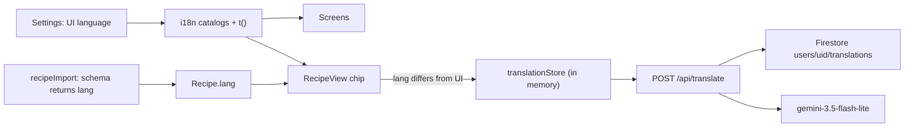

# Internationalization: UI language + on-demand recipe translation

Status: proposed, not audited. Work happens on the branch
`cursor/i18n-plan-1e8f`; see [Branch and review](#branch-and-review).

## Problem

Sous is English-only. All UI copy is inline English across about 400 strings
in `src/screens/`, `src/components/`, and a few `src/lib/` modules. Some server
routes also return English error text that the client shows as-is. Relative
times, plurals ("1 serving" / "2 servings"), and unit names are English
string templates.

Recipes are a separate problem. Import keeps the source wording ("faithful to
the original"), so the library already mixes languages: an Italian recipe
stays Italian. Switching the UI to Ukrainian would still leave a Ukrainian
reader with an Italian recipe. Translating every recipe up front
wastes Gemini calls on recipes nobody opens, and it goes stale when a recipe is
edited. The app also records nothing about what language a recipe is in, so
it can't know when translation is needed.

## Goals

- A **UI language** setting in Settings with four presets: English (`en`),
  Ukrainian (`uk`), Russian (`ru`), and Mandarin as Simplified Chinese
  (`zh-Hans`). Changing it switches all app copy right away, with correct
  plurals and number/time formatting.
- Every recipe carries a **language label** (`Recipe.lang`, a BCP-47 tag)
  from import, from its author's UI language, or detected the first time
  it is translated. The label can be corrected in the recipe form.
- When a recipe's language differs from the UI language, the recipe screen
  offers **on-demand translation**. One tap translates the whole recipe; a
  second tap returns to the original. Nothing is translated until the user
  asks.
- Translation is fast (a few seconds for a whole recipe), cheap (about
  $0.002 per recipe), and uses the existing Gemini API key.
- Translation takes as little screen space as possible: no per-line controls on
  ingredient or step rows.
- Dictation (`/api/stt`) transcribes in the UI language.

## Non-goals

- Translating the recipe library ahead of time, including Library card
  titles and search.
- Storing translations as recipe edits, or translating on import. The
  original text stays the source of truth.
- Translating `/about`, `/privacy`, and `/terms`. They stay English; only
  the links to them are translated.
- Translating the Chrome extension (`extension/`), the owner notification
  email, or server-rendered access/invite HTML.
- Right-to-left layout.
- Changing the chat request. Gemini already replies in the language the user
  writes in.
- Per-user cost metering for translation.

## Decisions and rejected alternatives

### One recipe-level toggle, not a button per line

The original idea was a small translate button next to each ingredient and
step. Rejected:

- In `src/screens/RecipeView.tsx`, every ingredient row is already a
  full-width `<button>` that checks it off, and every step row is one that
  advances cook mode. A button inside those rows is invalid HTML. It would
  take width on phones and invite accidental taps while cooking.
- Translating line by line costs one round trip of about 1 s per line, so
  30 to 60 taps for one recipe.
- A single line loses context: "the dough", "it", or an ingredient named only
  in the list.
- A reader of a foreign recipe wants all of it translated.

Instead, the recipe's existing meta line ("Prep N min · Cook N min") gets one
small chip. It reads "Italian · Translate", then shows a spinner, then
"Translated · Original".

### Model: Gemini Flash-Lite, not a dedicated translation API

Use `gemini-3.5-flash-lite` with `thinkingLevel: minimal` and structured JSON
output. The model is set by a new `TRANSLATE_MODEL` env var with that
default. One call translates the whole recipe. The cost is about $0.30 per
1M tokens in and $2.50 per 1M out, which is roughly $0.50 a month for 200
recipe translations. It adds no vendor, secret, or IAM change.

Rejected:

- **Cloud Translation NMT.** It is faster (about 0.2 to 0.4 s) and free
  up to 500k characters a month. But it needs the API enabled and a new role
  on the runtime service account, and it translates each segment without
  recipe context. Keep it as a drop-in fallback behind `translateSegments()`
  if measured latency from `europe-west1` is poor.
- **Cloud Translation LLM.** About $10 per 1M characters in and out, and
  the documented region is `us-central1`.
- **DeepL.** A new vendor and secret, and about $26 a month on current
  plans.
- **Chrome's built-in `Translator` / `LanguageDetector`.** They don't run on
  phones, Firefox, or Safari/iOS.
- **The chat model (`CHAT_MODEL`, default `gemini-3.7-flash`).** It costs 2.5
  times as much and has no minimal thinking level.

### `Recipe.lang` is a deliberate change to the schema lock

AGENTS.md says not to add fields to `Recipe`, and
`src/lib/recipeStore.test.ts` locks the key set. This plan lifts that lock
for one optional field, `lang?: string`, the same way `galleryPhotoIds` was
added. Every place that strips unknown keys changes together (step 5), and
AGENTS.md records the exception.

Detecting the language at view time without a stored field was considered.
It was rejected in favour of a stored field that the user can correct.

### Leave the chat request alone

`api/chat.ts`'s Gemini request shape is on the AGENTS.md do-not-touch list.
No locale is sent. Only client-side chat copy (for example "Here is my
proposed change:") moves to the catalogs.

## Architecture

## Design notes

- **No i18n library.** A typed catalog per locale in `src/i18n/`, where
  `en.ts` defines the `Messages` type so TypeScript checks that every locale
  has every key.
  - `t(key, params)` handles text, and plural keys select a form with
    `Intl.PluralRules`. Ukrainian and Russian need `one` / `few` / `many` /
    `other`; Chinese needs only `other`.
  - `Intl.RelativeTimeFormat` replaces the English templates in
    `src/lib/relativeTime.ts`.
  - `Intl.NumberFormat` handles decimals. Unicode fractions like `½` stay.
  - About 400 strings in total, so all catalogs are bundled.
- **Language setting.** Stored as `cook.locale` in localStorage next to
  `cook.theme` (`src/lib/settings.ts`). It defaults to the browser language
  (`navigator.language`) if supported, otherwise `en`. The inline boot script
  in `index.html` sets `<html lang>` before first paint, like the theme.
  React re-renders on change through a small store read with
  `useSyncExternalStore`.
- **Units.** Stored unit names are English tokens (`src/lib/units.ts`). The
  catalogs map the known tokens to display labels for each language. Custom
  units go through translation.
- **Server error text.** `server/importRoute.ts`, `server/stt.ts`, and
  `server/admin.ts` add a machine-readable `code` next to the existing
  English `error`. The client maps codes to catalog text and falls back to
  `error`.
- **Recipe language labels.**
  - Format: a normalized BCP-47 tag, for example `it`, `uk`, or `zh-Hans`.
    `normalizeImportedRecipe` drops tags that fail to parse.
  - Translation is offered when the primary subtag differs from the UI
    language. Chinese compares the full tag, so `zh-Hant` and `zh-Hans` count
    as different.
  - Unlabelled recipes show a muted Translate chip. The translate response's
    `detectedLang` is saved through `recipeStore.save`. If it matches the UI
    language, the chip is hidden.
  - Hand-created recipes default to the current UI language.
  - The chat tool `update_recipe` never sees `lang`. `applyDraft` carries
    `existing.lang`, like `sourceUrl`.
- **`POST /api/translate`** (`server/translate.ts`, registered in
  `scripts/server.ts`).
  - Built like `server/stt.ts`: `requireMember` (401 means denied, 503
    means unknown). A missing `GEMINI_API_KEY` returns 503, a bad body 400,
    over the caps (about 200 segments, 20k characters) 413, and a Gemini
    failure or mismatched output 502.
  - Body `{ recipeId, target, segments: [{ id, text }] }`, where `target` must
    be a supported UI language. It returns `{ detectedLang, segments }`.
  - The prompt: translate cooking text, keep numbers, units and
    temperatures as written, don't convert units, keep dish names, and return
    exactly the ids given.
  - Server cache: `users/{uid}/translations/{recipeId}.{target}` stores
    `{ hash, segments, detectedLang, model, createdAt }`, where `hash` is a
    SHA-256 of the segments. A hit skips Gemini. This is derived data outside
    sync, so no tombstones or push kinds are needed.
  - Client cache: an in-memory Map in `src/lib/translationStore.ts`, keyed by
    recipe, target, and hash. Nothing is stored on the device.
  - `src/lib/translateApi.ts` makes the fetch, like `sttApi.ts`. A 401 calls
    `invalidateSession()`.
- **Segments.** `src/lib/recipeTranslation.ts` holds pure helpers:
  - `recipeSegments(recipe)` returns ids and text for the title,
    description, notes, section names, each ingredient's `item` and `note`,
    custom units, and each step.
  - `applyTranslation(recipe, map)` returns a display-only recipe.
  - Quantities and structure are unchanged, so servings scaling and
    cook-mode keys keep working.

## Steps

Each step names its owner tag.

1. **[core] i18n foundation.** Add `src/i18n/` catalogs (`en`, `uk`, `ru`,
   `zh-Hans`), `t()`, plural selection, and the locale store. Add
   `getLocale` / `setLocale` to `src/lib/settings.ts`, and have the
   `index.html` boot script set `<html lang>`. Rewrite `relativeTime.ts` on
   `Intl.RelativeTimeFormat`, and make quantity decimals locale-aware. Add a
   catalog parity test and a plural coverage test.
2. **[ui] Move copy to catalogs.** Move all copy in `src/screens/`,
   `src/components/`, `SyncToast`/`syncEngine` messages, and client error
   strings to `t()`. Add a language picker in Settings next to Appearance,
   and localize unit labels in `RecipeForm` and `RecipeView`.
3. **[core] Server error codes.** Add `code` fields to JSON errors from
   import, stt, and admin, and map them on the client in `importApi.ts`,
   `sttApi.ts`, and `adminApi.ts`.
4. **[core] Dictation language.** `server/stt.ts` accepts a supported
   language from the client and builds the transcription prompt from it
   instead of `Language: English.`. `sttApi.ts` sends the UI language.
5. **[core] `Recipe.lang`.** Add optional `lang` to:
   - `src/lib/types.ts`
   - `src/lib/compactRecipe.ts`
   - `compactRecipeFields` and payload validation in `server/store.ts`
   - `src/lib/recipeShape.ts`
   - `applyDraft` in `src/lib/recipeStore.ts`
   - the import `RECIPE_SCHEMA` and `normalizeImportedRecipe` in
     `server/recipeImport.ts`, plus `server/recipeFromExtraction.ts`

   Also update `src/lib/recipeStore.test.ts`: the optional-keys case changes,
   the required set does not. Add a lang-normalization test and the
   AGENTS.md exception note. `api/chat.ts` stays unchanged.
6. **[ui] Recipe language in the form.** New recipes default `lang` to the
   UI language. `RecipeForm` gets a compact "Recipe language" select.
7. **[core] Translation backend.** Add `server/translate.ts` with the route,
   caps, prompt, output validation, and Firestore cache, plus
   `TRANSLATE_MODEL` in env docs and `scripts/deploy.sh`'s env file. Add
   `src/lib/recipeTranslation.ts`, `translateApi.ts`, and
   `translationStore.ts`, with pure tests for the segment round trip and
   route validation.
8. **[ui] Translate chip.** Add the chip on the `RecipeView` meta line with
   its idle, loading, translated, and error states. Render translated
   segments while it is on, and save `detectedLang` for unlabelled recipes.
9. **[ui] Legal copy.** Update `/privacy` and `/terms`: recipe text is sent
   to Gemini for translation, cached translations are stored in Firestore,
   and the language preference is kept in localStorage.
10. **[core] Import eval.** Assert `lang === 'it'` for the
    `evals/import-sites/giallozafferano-carbonara` fixture in
    `evals/recipeImport.eval.ts`.

Milestones: steps 1 to 4 (UI i18n), steps 5, 6 and 10 (recipe `lang`), and
steps 7 to 9 (translation).

## Branch and review

- All implementation commits go straight to `cursor/i18n-plan-1e8f`. Commit
  and push after each step.
- **Do not open a pull request until the implementation is complete and
  ready for review.** That means every step is done, the verification
  section passes, and the verifier has returned PASS. Do not open draft PRs
  for work in progress or for individual milestones.
- When it is ready, open a single PR from `cursor/i18n-plan-1e8f` into
  `main`.

## Verification

- `npm run build` and `npm test` pass. The pure tests cover:
  - catalog parity, and plural coverage for `uk` and `ru`
  - the segment round trip
  - `lang` normalization
  - translate request caps and output validation
  - the updated compact tests
- `npm run test:import` passes, including the `lang` assertion.
- In the browser, with Vite and `dev:api` running and signed in at
  `localhost:5173`:
  - Switch through all four languages on every route, including plurals
    (servings 1, 2, 5, 21) and relative times.
  - Open the Italian carbonara with the UI in Ukrainian, translate it, and
    toggle back to the original.
  - While translated, check servings scaling and cook-mode checkmarks.
  - Reopen the recipe and confirm it loads from the cache.

## Open questions

- Mandarin is assumed to mean Simplified Chinese (`zh-Hans`). If Traditional
  (`zh-Hant`) is wanted too, it is a fifth catalog, not a design change.
- Latency from `europe-west1` has not been measured. If a whole-recipe call
  is slow, split it into two parallel requests (header and ingredients, then
  steps) before switching to Cloud Translation NMT.
