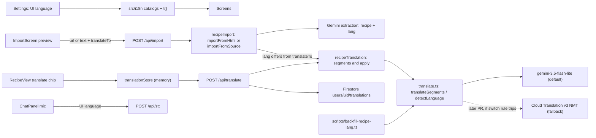

# Internationalization: UI language, recipe language, and translation

Status: proposed, not yet audited. For review history, see this file's
commit log (`git log -- docs/plans/i18n.md`). Work happens on the branch `cursor/i18n-plan-1e8f`; see
[Branch and review](#branch-and-review).

Post-deploy follow-ups for the owner, not part of this branch:
- measure Cloud Run `europe-west1` translate p95 and apply the latency rule
  in [Provider](#provider-gemini-flash-lite-by-default-cloud-translation-nmt-as-fallback)
- run the backfill script with `--write` (step 15)

The rules for this feature are in the
[i18n constitution](i18n-constitution.md) (moved to `src/i18n/AGENTS.md` in
step 1). This plan must stay consistent with it. Where they disagree, the
constitution wins until it is amended through its own protocol.

## Problem

Sous is English-only. All UI copy is inline English across about 400 strings
in `src/screens/`, `src/components/`, and a few `src/lib/` modules. Some server
routes (`server/importRoute.ts`, `server/stt.ts`, `server/admin.ts`) return
English error text that the client shows as-is. Relative times
(`src/lib/relativeTime.ts`), plurals ("1 serving" / "2 servings"), and unit
names (`src/lib/units.ts`) are English string templates. Dictation
(`server/stt.ts`) tells Gemini `Language: English.`

Recipes are a separate problem. Import keeps the source wording ("faithful to
the original"), so the library already mixes languages: an Italian recipe
stays Italian. Switching the UI to Ukrainian would still leave a Ukrainian
reader with an Italian recipe. The app records nothing about what language a
recipe is in, so it can't know when translation is needed.

## Goals

- A **UI language** setting in Settings with four presets: English (`en`),
  Ukrainian (`uk`), Russian (`ru`), and Mandarin as Simplified Chinese
  (`zh-Hans`). Changing it switches all app copy right away, with correct
  plurals and number/time formatting.
- Every recipe can carry a **language label** (`Recipe.lang`, a canonical
  BCP 47 tag): from import, from the author's UI language for hand-made
  recipes, or detected. The label can be corrected in the recipe form.
- **Guessed language at import.** Every single-recipe import preview says
  which language the recipe seems to be in and lets the person change it
  before saving. This is most prominent for pasted text.
- **Translate on import.** When an imported recipe's language differs from
  the UI language, the preview shows "Translate into <UI language>", checked
  by default. Unchecking it keeps the original. Bulk import gets one
  checkbox for the batch.
- **On-demand translation on the recipe screen.** For recipes in another
  language, one toggle on the meta line translates the whole recipe; a second
  tap returns to the original. Nothing is translated until the person asks.
- Translation is fast enough (a few seconds for a whole recipe), cheap (about
  $0.002 per recipe), and uses the existing Gemini API key by default.
- Translation takes as little screen space as possible: no per-line controls
  on ingredient or step rows.
- **Dictation** (`/api/stt`) transcribes in the UI language. If testing shows
  poor results for a language, dictation falls back to English and the mic
  says so.
- **New UI text stays translated.** A root `AGENTS.md` rule requires every
  future change that adds or changes UI text to add it to every catalog and
  to pass an **in-context translation review**. The review takes screenshots
  of each affected screen in every language and has an LLM judge whether the
  translated strings make sense together on that page. This branch delivers
  the review as written instructions any agent can follow
  (`docs/i18n-review/`), with a thin Cursor skill wrapper. A standalone,
  IDE-independent suite is an
  [upcoming milestone](#upcoming-milestone-standalone-i18n-review-suite).

## Non-goals

- Translating the library ahead of time or in the background, including
  Library card titles and search.
- Storing runtime (recipe-screen) translations as recipe edits. Only import
  can save translated text, and only when the person leaves the box checked.
- Translating `/about`, `/privacy`, and `/terms`. They stay English; only the
  links to them are translated.
- The Chrome extension (`extension/`): import translation and popup copy are
  the [upcoming milestone](#upcoming-milestone-chrome-extension), on a
  separate branch. This branch only makes the server ready for it.
- The owner notification email and server-rendered access/invite HTML.
- Right-to-left layout.
- Changing the chat request. Gemini already replies in the language the user
  writes in.
- Per-user cost metering for translation.
- The standalone i18n review suite (`npm run test:i18n`). This branch ships
  the Cursor-driven review only; the standalone suite is an
  [upcoming milestone](#upcoming-milestone-standalone-i18n-review-suite).
- Photo or handwriting OCR import. There is no photo import today (see
  [Design notes](#import-guessed-language-and-translate-on-import)).

## Language codes

Every stored or transmitted language is a **BCP 47** tag (constitution
principle 5):

- The primary subtag is the **ISO 639-1** language code: `en`, `uk`, `ru`,
  `zh`, `it`, `fr`.
- An **ISO 15924** script subtag is added only where the script changes the
  meaning: `zh-Hans` (Simplified), `zh-Hant` (Traditional).
- **Country codes are never language codes.** No `ua`, `cn`, `jp`, `gr`,
  `cz`, `dk`, `se`. Region subtags (`en-GB`) are not stored either.
- **Normalization at every boundary** (model output, request bodies,
  backups, the form, `navigator.language`, the backfill script) is one
  function, `normalizeLang`. It has a client copy and a server copy, kept
  identical by a parity test (see [UI copy](#ui-copy)). It applies these
  rules in order:
  1. `Intl.getCanonicalLocales` for canonical case. Anything that fails to
     parse is dropped; the recipe is then unlabelled, which is always allowed.
  2. The alias map for common mistakes: `ua`→`uk`, `cn`→`zh`, `jp`→`ja`,
     `gr`→`el`, `cz`→`cs`, `dk`→`da`, `se`→`sv`.
  3. **Chinese script from region, before anything is stripped.** An
     explicit script wins (`zh-Hans`, `zh-Hant`). Otherwise the region
     decides it: `zh-CN` and `zh-SG` become `zh-Hans`; `zh-TW`, `zh-HK` and
     `zh-MO` become `zh-Hant`. Browsers and models usually send `zh-CN`, so
     without this step a Mandarin browser would fall back to English and
     Simplified recipes would never match the UI.
  4. Strip region and any other subtags, keeping language plus script only
     for `zh`.
- A bare `zh` (no script and no region) is stored as `zh`, and comparison
  treats it as unknown script (see
  [Recipe language labels](#recipe-language-labels)). For the UI default only,
  a bare `zh` browser language maps to `zh-Hans`, because that is the only
  Chinese UI.
- **Provider codes stay in the adapter.** Cloud Translation wants `zh-CN`
  for Simplified Chinese; that mapping exists only inside the NMT adapter and
  is never stored or returned.

**Why `uk`, not `ua`.** `uk` is the ISO 639-1 code for the Ukrainian
*language*. `ua` is the ISO 3166-1 code for the *country* Ukraine (as in the
`.ua` domain). Language tags use language codes, so Ukrainian is `uk`, just
as Chinese is `zh`, not `cn`. Browsers report `uk` / `uk-UA` in
`navigator.language`, and `Intl` APIs expect `uk`. The alias map accepts `ua`
as input so the mistake never breaks anything.

## Decisions and rejected alternatives

### One recipe-level toggle, not a button per line

The original idea was a small translate button next to each ingredient and
step. Rejected (constitution principle 3):

- In `src/screens/RecipeView.tsx`, every ingredient row is already a
  full-width `<button>` that checks it off, and every step row is one that
  advances cook mode. A button inside those rows is invalid HTML. It would
  take width on phones and invite accidental taps while cooking.
- Translating line by line costs one round trip per line, so 30 to 60 taps
  for one recipe.
- A single line loses context: "the dough", "it", or an ingredient named only
  in the list.
- A reader of a foreign recipe wants all of it translated.

Instead, the recipe's meta line ("Prep N min · Cook N min", around
`RecipeView.tsx` lines 128–131) gets one small chip. It reads "Italian ·
Translate", then shows a spinner, then "Translated from Italian · Original".

### Provider: Gemini Flash-Lite by default, Cloud Translation NMT as fallback

**Decision** (recorded in the constitution's Current decisions):
`gemini-3.5-flash-lite`, thinking level `minimal`, default temperature,
structured JSON output. Behind one interface in `server/translate.ts`
(`translateSegments`, `detectLanguage`), selected by env:
`TRANSLATE_PROVIDER` and `TRANSLATE_MODEL` (for Gemini). This branch
implements only the Gemini adapter, so `gemini` (the default) is the only
accepted provider value. Any other value fails closed: `/api/translate`
returns 503 with code `translate-provider-unavailable`, and import skips
translation with `translationFailed`. The NMT adapter is built only if the
switch rule trips (see below).

**Re-evaluation.** An earlier draft argued against Cloud Translation NMT
partly because it needs the API enabled and an IAM role, and listed "no new
vendor, secret, or IAM change" under *Risk*. That was mislabeled: it is a
benefit (operational simplicity), and a minor one, because NMT's setup is a
one-time `gcloud services enable` plus one role binding (see
[Appendix](#appendix-nmt-one-time-setup-owner)). So the real question is
whether NMT's lack of recipe context alone justifies defaulting to Gemini.

On its own, context would be a weak reason if latency dominated. Here it
doesn't, and context matters more than usual:

1. **Context is a correctness issue for `uk` and `ru`.** Pronouns and
   past-tense verbs agree in grammatical gender with a noun named earlier,
   often in an earlier step or only in the ingredient list ("Add it and stir
   until it thickens" where "it" is the feminine *сметана* or the masculine
   *соус*). NMT translates essentially sentence by sentence, even in HTML
   mode with the whole recipe in one request, so it guesses gender at exactly
   these points. One Gemini call sees the whole recipe.
2. **Latency is mostly hidden.** Translate-on-import is on by default, so
   most foreign recipes are translated at import, where a few seconds are
   already expected. The runtime toggle mostly serves recipes imported
   before this feature and UI-language switches.
3. **Cost.** NMT is free up to 500k characters a month, then about $20 per
   1M characters, about $0.05 per 2,500-character recipe. Gemini is about
   $0.002 per recipe, roughly 25 times cheaper beyond the free tier. At this
   app's volume both are cents a month, so cost is a tiebreaker, not a
   driver.

NMT's real advantages are **latency** (about 0.2–0.4 s against an
estimated, unmeasured 2–7 s for a whole recipe on Gemini) and
**determinism** (exactly one output per input, so id mismatches can't
happen). Those are why it stays the documented fallback.

**Why `gemini-3.5-flash-lite`.** It is Google's current GA low-latency,
low-cost tier, lists translation as a target use, and supports structured
output. $0.30 per 1M input tokens and $2.50 per 1M output tokens.
Alternatives: `gemini-3.1-flash-lite` ($0.25 / $1.50) may shut down from
May 7, 2027; `gemini-2.5-flash-lite` is restricted to accounts that used it
before; the chat model `gemini-3.7-flash` costs 2.5 times as much (doubling
on January 1, 2027) and its lowest thinking level is `low`.

**Why thinking level `minimal`.** Translation gains nothing from multi-step
reasoning. Thinking tokens are billed as output and delay the first output
token. `minimal` is the lowest level on Gemini 3.x; it is not guaranteed to
be zero thinking. Temperature stays at the default, because Google's Gemini 3
guidance advises against lowering it.

**How latency is measured.** There is no staging: `scripts/deploy.sh`
deploys straight to production. So nothing on this branch is deployed just
to measure it.

- **This branch (step 14):** measure the single whole-recipe call locally,
  p50 and p95 over repeated runs. The output limit is not a constraint:
  `gemini-3.5-flash-lite` allows 65,536 output tokens, so a whole recipe fits
  in one call.
- **After the reviewed PR is merged and deployed:** the owner measures p95
  from Cloud Run `europe-west1`. That is a post-deploy follow-up, not part
  of this branch's verification.

**When to act on latency or quality.**

- If deployed p95 for the runtime toggle is above about 4 s, first try the
  cheap fix: have the Gemini adapter split a recipe into two parallel
  requests (header plus ingredients, and steps; each sends the whole recipe
  as context and returns only its own ids). If p95 is still above 4 s,
  switch to NMT.
- If the translate eval finds quality problems NMT doesn't have, switch to
  NMT.

The split is not built on this branch; it only exists if the measurement
calls for it.

Switching is not just a config change on this branch. It takes a separate,
reviewed PR that:
- adds the NMT adapter behind the same interface, with pure tests of its
  request building and response mapping (HTTP stubbed at the adapter
  boundary)
- does the one-time setup in the
  [Appendix](#appendix-nmt-one-time-setup-owner)
- sets `TRANSLATE_PROVIDER=nmt`
- updates the constitution's Current decisions (principle 11)

Other rejected options:

- **Cloud Translation LLM (Adaptive / TLLM).** About $10 per 1M characters in
  and out, and the documented region is `us-central1`.
- **DeepL.** A new vendor and secret, and about $26 a month on current plans.
- **Chrome's built-in `Translator` / `LanguageDetector`.** Not available on
  phones, Firefox, or Safari/iOS.
- **Extracting and translating in one import call.** The preview needs both
  the faithful original and the translation, the extraction model is the
  pricier chat model, and one call would double its output. Import makes a
  second, cheap translate call instead.

### `Recipe.lang` is a deliberate change to the schema lock

Root `AGENTS.md` says not to add fields to `Recipe`, and
`src/lib/recipeStore.test.ts` locks the key set. This plan lifts that lock for
one optional field, `lang?: string`, the way `galleryPhotoIds` was added
(constitution principle 7). Every place that strips unknown keys changes
together (step 6), and `AGENTS.md` records the exception.

Detecting the language at view time without a stored field was considered.
It was rejected in favour of a stored field the person can correct.

### Leave the chat request alone

`api/chat.ts`'s Gemini request shape is on the `AGENTS.md` do-not-touch list
(constitution principle 13). No locale is sent, and `api/chat.ts` does not
learn about `lang`. Only client-side chat copy (for example "Here is my
proposed change:") moves to the catalogs.

That also means **`lang` is stripped before chat sends the recipe.**
`chatApi.ts` (around line 46) posts the whole recipe, and `api/chat.ts`
(around line 230) writes it into the system prompt with `JSON.stringify`.
Without stripping, the model would see `"lang":"it"`. `chatApi.ts` removes
`lang` from the recipe it sends, so the chat request stays exactly as
before.

If someone asks chat to translate the recipe ("put this in Ukrainian") and
applies the result, `applyDraft` keeps the old `lang` (for example `it`).
That wrong label is expected and tolerated (principle 6):
- the chip offers a translation of text that is already Ukrainian, and the
  translator's `detectedLang` then shows "already in Ukrainian" and hides
  the chip for the session
- the edit form pre-fills that detected language, so the next save the
  person starts fixes the label

Nothing writes it in the background.

## Architecture

## Design notes

### UI copy

- **No i18n library.** A typed catalog per locale in `src/i18n/`, where
  `en.ts` defines the `Messages` type so TypeScript checks that every locale
  has every key.
  - `t(key, params)` handles text with named parameters. Plural keys select a
    form with `Intl.PluralRules`: `uk` and `ru` need `one` / `few` / `many` /
    `other`; Chinese needs only `other`.
  - `Intl.RelativeTimeFormat` replaces the English templates in
    `src/lib/relativeTime.ts`.
  - `Intl.NumberFormat` handles decimals. Unicode fractions like `½` stay.
  - `Intl.DisplayNames` gives language names ("Italian", "італійська") in the
    UI language.
  - About 400 strings in total, so all catalogs are bundled.
- **Language setting.** Stored as `cook.locale` in localStorage next to
  `cook.theme` (`src/lib/settings.ts`). It defaults to the browser language
  (`navigator.language`, normalized) if supported, otherwise `en`. The inline
  boot script in `index.html` sets `<html lang>` before first paint, like the
  theme. `setLocale` writes localStorage, then sets
  `document.documentElement.lang`, then notifies subscribers. React
  re-renders through a small store read with `useSyncExternalStore`, so
  `<html lang>` is always right after a change in Settings, not only at boot.
- **Where the language helpers live.** `normalizeLang`, `sameLanguage`, and
  the supported-language list are needed on both sides: the client (Settings,
  the form, the chip) and the server (import, `/api/translate`, `/api/stt`,
  the backfill). The server image copies only `api/`, `server/`, and
  `scripts/` (`Dockerfile`, lines 18–20), so the server can't import from
  `src/`.
  - Two identical pure modules: `src/i18n/lang.ts` and `server/lang.ts`.
    This follows the existing pattern of server copies (for example
    `compactGalleryPhotoIds`).
  - `server/lang.test.ts` imports both and runs one shared table of cases
    through each, asserting identical results. Server tests already import
    from `src/`, for example `server/recipeImport.test.ts` imports
    `../src/lib/types.ts`.
  - The parity test is the guard: changing one copy without the other fails
    `npm test`.
- **Units.** Stored unit names are English tokens (`src/lib/units.ts`). The
  catalogs map the known tokens to display labels for each language. Custom
  units go through translation.
- **Server error text.** Server JSON errors add a machine-readable `code`
  next to the existing English `error` (principle 10). The client maps codes
  to catalog text and falls back to `error`.

### Recipe language labels

- `lang` is optional and best-effort (principle 6). Code must work when it is
  missing or wrong.
- **Comparison.** "Needs translation" means the primary subtags differ. For
  Chinese the script matters: `zh-Hant` against `zh-Hans` counts as
  different, and a bare `zh` counts as unknown (neutral chip, detect on
  translate).
- **Sources.** Import (the extraction schema returns `lang`), the recipe
  form, the translate response's `detectedLang`, and the backfill script.
- **Hand-made recipes.** "New recipe" defaults `lang` to the UI language
  through `RecipeForm`'s language field.
- **Chat.** The chat model never sees `lang`: `chatApi.ts` strips it before
  sending, and the `update_recipe` tool schema doesn't have it. `applyDraft`
  carries `existing.lang`, like `sourceUrl`. A translation done through chat
  leaves a stale label (see
  [Leave the chat request alone](#leave-the-chat-request-alone)).
- **Detected but unlabelled.** When `/api/translate` detects the language of
  an unlabelled recipe, `translationStore` keeps `detectedLang` in memory
  only. It becomes the recipe's `lang` only on the next save the person
  starts from the edit form, which pre-fills the language field with it. See
  [Backfill analysis](#backfill-analysis) for why it is never written in the
  background.

### Language picker

One shared component for the recipe language, used by the import preview's
guessed-language line and by `RecipeForm`'s "Recipe language" field (step
10). A recipe may be in any language (principle 15), so the picker can't be
limited to a "common" list.

- A native `<select>`, with no new dependency and good phone behaviour, in
  two groups:
  - **App languages:** `en`, `uk`, `ru`, `zh-Hans`.
  - **All languages:** every ISO 639-1 code, plus `zh-Hant`, sorted by the
    name `Intl.DisplayNames` gives in the UI language.
- The code list (about 185 two-letter codes) is a static array in
  `src/i18n/lang.ts`. Names come from `Intl.DisplayNames`. Codes it can't
  name are left out rather than shown as raw codes.
- If the current value isn't in the list (a bare `zh`, or a rare tag from
  the model), it is kept and shown as its own option at the top, so opening
  and saving the form never silently changes it.
- An empty option ("Unknown") maps to no `lang`.
- It ends with a scoped in-context review wherever it appears.

### Translation layer (server)

- **`server/translate.ts`**: the provider interface and provider selection.
  Only `gemini` is accepted; any other `TRANSLATE_PROVIDER` fails closed with
  `translate-provider-unavailable`.
  - `translateSegments({ segments, target, sourceLang? })` returns
    `{ detectedLang, segments }`; `detectLanguage(text)` returns a tag or
    `null`.
  - The Gemini adapter: one structured call, output schema
    `{ detectedLang, segments: [{ id, text }] }`, thinking level `minimal`,
    `maxOutputTokens` sized to the caps. The prompt: translate cooking text,
    keep numbers, units and temperatures as written, don't convert units,
    keep dish names recognisable, and return exactly the ids given.
  - Output is validated: the same ids, once each, same order, non-empty
    strings. Anything else is an error; nothing is partly applied
    (principle 4).
  - Env is read per request (like `recipeImportDepsFromEnv`), using `||` not
    `??` so a bare `TRANSLATE_MODEL=` means the default.
- **`server/recipeTranslation.ts`**: pure helpers.
  - `recipeSegments(recipe)` returns ids and text for the title,
    description, notes, section names, each ingredient's `item` and `note`,
    custom (non-token) units, and each step.
  - `applyTranslation(recipe, segments)` returns a recipe with identical
    structure and translated text. Quantities, known unit tokens, order, and
    counts are unchanged, so servings scaling and cook-mode keys keep
    working.
  - It lives on the server because the server image cannot import from
    `src/` (the server already duplicates helpers, for example
    `compactGalleryPhotoIds` in `server/store.ts`). It keeps its own copy of
    `COMMON_UNITS` from `src/lib/units.ts`, the list of known unit tokens
    that are never translated. A test asserts the two lists are identical.
- **`POST /api/translate`** (`server/translateRoute.ts`, registered in
  `scripts/server.ts`).
  - `requireMember` (401 means denied, 503 means unknown). A missing
    `GEMINI_API_KEY` (Gemini provider) returns 503, a bad body 400, over the
    caps (about 200 segments, 20k characters) 413, and a provider failure or
    mismatched output 502. Every error carries a `code`.
  - Body: `{ recipeId?, target, sourceLang?, recipe }`, where `recipe` holds
    only the translatable fields and structure (validated and compacted like
    `server/store.ts` does), and `target` must be a supported UI language.
  - Response: `{ detectedLang, recipe }`, a display-only recipe with identical
    structure.
  - `recipeId` is optional. With it, the server cache is used; without it
    (the import preview after the person corrects the language), nothing is
    cached.
  - **`recipeId` validation.** It must match `^[A-Za-z0-9_-]{1,128}$`, so it
    can never contain `/` and the cache path is always exactly one document
    under the caller's own `users/{uid}`. Anything else is 400. `uid` comes
    only from the session.
  - **The client sends the text.** The server translates the submitted
    recipe, not the stored one, so a member can only spend their own
    requests. The caps and the rate guard bound that.
  - **Rate guard.** Each container instance counts calls per member in
    memory, for example 60 provider calls per member per hour, and returns
    429 with a `code` beyond that. Cache hits don't count. It is an
    approximate abuse guardrail, like the 60-second membership cache, not
    metering (metering stays a non-goal).
  - **Server cache**: `users/{uid}/translations/{recipeId}.{target}` stores
    `{ recipeId, hash, segments, detectedLang, provider, model, createdAt }`.
    - `hash` is a SHA-256 of the source segments plus a
      `TRANSLATION_VERSION` constant, bumped when the prompt or provider
      changes.
    - A matching hash skips the provider. A different hash is a miss: the
      server translates and overwrites the doc.
    - It is derived data outside sync, so there are no tombstones or push
      kinds (principle 7).
  - **Deletion, in the same transaction.** Cache doc ids are
    deterministic (`{recipeId}.{target}`, where `target` is one of the four
    UI languages).
    - **Where.** Recipes are tombstoned in one place: the transaction in
      `cascadeRecipeDelete` (`server/store.ts`, around line 641), called
      from the sync delete route (`server/sync.ts`, around line 161). That
      transaction also deletes `translations/{recipeId}.en`, `.uk`, `.ru`
      and `.zh-Hans`, with no query. Deleting a doc that doesn't exist is a
      no-op, and it adds at most four writes.
    - **Always, including when the tombstone is rejected as stale.**
      `compareMutation` can reject the tombstone because a newer edit won.
      The recipe then stays live, and the cache is deleted anyway. That is
      always safe: the cache is derived, and a newer edit changes the text
      hash anyway. It also keeps the rule simple: a delete request always
      clears the cache.
    - The tombstone and the cache deletion commit together or not at all. `/privacy` promises that
    deleting a recipe deletes its related data, and this keeps that promise
    true.
  - **Removing a UI language later** means deleting its cache docs as part
    of that change, since tombstoning would no longer look for them.
    Principle 15 lists this.
- **Client** (`src/lib/translateApi.ts`, like `sttApi.ts`; a 401 calls
  `invalidateSession()`). `src/lib/translationStore.ts` keeps an in-memory
  Map keyed by recipe id, target, and `updatedAt` (any edit bumps it), plus
  the per-recipe toggle state so cook mode and back keep the translated
  view. Nothing is stored on the device (principle 8).

### Recipe screen toggle

- The chip sits on the meta line; if the recipe has no prep or cook time, the
  meta line still renders for the chip.
- States: labelled and different ("Italian · Translate"), unlabelled (muted
  "Translate"), loading (spinner), translated ("Translated from Italian ·
  Original"), error ("Couldn't translate · Retry"). Hidden when `lang`, or
  the in-memory `detectedLang`, matches the UI language.
- If the response's `detectedLang` matches the UI language, the view stays on
  the original, the chip hides, and a short notice says the recipe is already
  in that language.
- **Two values, never one.** `RecipeView` keeps the stored `recipe` and
  derives a separate `displayRecipe` (the translation while the toggle is
  on, otherwise `recipe`).
  - `displayRecipe` feeds only the rendered body: title, description,
    ingredient labels, section names, steps, and notes.
  - Everything else keeps the stored `recipe`: `ChatPanel` (`recipe={recipe}`,
    around line 287), the cook-state context (`checkedItemNames(recipe)`),
    edit, share and backup.
  - If the translation replaced `recipe`, a chat edit would go through
    `applyDraft` and save translated text as the recipe, breaking principle
    1. A comment at the split states this.
- If the recipe changes while translated, the view returns to the original
  and the chip goes idle; the person taps again (principle 2).

### Import: guessed language and translate-on-import

**"Handwritten" import** means a recipe pasted or typed as text into
`/import`. There is no photo or OCR import, and this plan doesn't add one.

- **Server pipeline** (`server/recipeImport.ts`). `RecipeImportDeps` gains a
  `translator` (the `server/translate.ts` interface). Both entry points take
  an optional `translateTo`:
  - `importFromSource` takes it directly. It is used by pasted text
    (`server/importRoute.ts`, around line 82).
  - `importFromHtml` must pass it through. Today it forwards only the html
    and deps (`server/recipeImport.ts`, around lines 536–537), and it is the
    path for URL import (`importRoute.ts`, around line 73) and the extension
    (`server/extensionImport.ts`, around line 135). Without this, URL and
    extension imports would never translate.
  - The extraction call is unchanged in model and prompt except that
    `RECIPE_SCHEMA` gains `lang` (the source's language as a BCP 47 tag), and
    `normalizeImportedRecipe` normalizes it. The text stays faithful to the
    source.
  - If `translateTo` is set and the extracted `lang` differs from it (by the
    comparison rule), the pipeline builds segments with
    `server/recipeTranslation.ts`, calls `translateSegments`, and applies them.
  - If `translateTo` is set and `lang` is **missing or ambiguous**, the
    pipeline still translates without a source language and takes
    `detectedLang` from the provider. Missing means the model omitted it or
    normalization dropped it. Ambiguous means `sameLanguage(lang,
    translateTo)` returns `unknown`, as for a bare `zh` against the
    `zh-Hans` UI. If the
    detected language matches `translateTo`, it discards the translation
    and sets `lang` to the detected language. Otherwise it returns the
    translation and sets the original's `lang` to the detected language. A
    failed guess must not silently skip the default-on checkbox.
  - `RECIPE_SCHEMA`'s comment says to keep it in sync with `api/chat.ts`.
    `lang` is the exception: it is import-only and must not be copied into
    `api/chat.ts` (principle 13). The comment is updated to say so.
  - The `ok` outcome becomes `{ kind: 'ok', recipe, translation? }` where
    `translation` is `{ kind: 'ok', lang, recipe }` or `{ kind: 'failed' }`.
    Translation failure (provider error, caps, mismatched ids) **never** fails
    the import (principle 12).
  - Import translations are not cached: the recipe has no id yet, and a saved
    translated recipe is already in the UI language.
- **`POST /api/import`** body gains optional `translateTo` (a supported UI
  language; anything else is 400). The route passes it to `importFromHtml`
  (URL) or `importFromSource` (text), and `outcomeResponse` in
  `server/importRoute.ts` serializes the new fields. The response is
  `{ recipe, translation?: { lang, recipe }, translationFailed?: true }`.
  Import latency grows by one translate call only when translation runs.
- **Client** (`src/lib/importApi.ts`). `importRecipe` today returns only
  `data.recipe` and drops sibling fields. Its return type becomes
  `{ recipe, translation?, translationFailed? }`, and it sends `translateTo`.
  `ImportScreen` and bulk import are updated for the new shape.
- **`POST /api/extension/import`** accepts the same optional `translateTo`.
  When translation succeeds it saves the translated recipe with `lang` set to
  `translateTo`; on failure it saves the original. The response adds
  `translated: boolean`. Today's extension ignores it, so the extension
  milestone needs only client changes.
- **Preview** (`src/screens/ImportScreen.tsx`, the `CreateRecipeForm` under
  "Anything the extraction got wrong, fix it here before saving."):
  - **Preview state keeps two languages apart.** `sourceLang` is the
    language of the original text: the guess, which the person can correct.
    The target is the UI language. The original draft saves with `lang =
    sourceLang`, and the translated draft saves with `lang` = the UI
    language. The guessed-language line edits only `sourceLang` and never
    the translated draft's `lang`. The `lang` for either draft is set from
    this state at save time. The form's own language field (step 10) is
    hidden in the preview so the two can't disagree.
  - A compact line: "Looks like Italian. Change it if that's wrong." with a
    language select (see [Language picker](#language-picker)). It edits
    `sourceLang`. It shows on every single-recipe preview and is emphasized
    (notice styling) for pasted text, where the guess has less to go on.
  - Below it, when the guessed language differs from the UI language:
    "Translate into Ukrainian", checked by default. The client holds both
    versions, so toggling swaps the form's content instantly. If the form has
    edits, toggling first asks to confirm discarding them.
  - **How the swap works.** `RecipeForm` copies `initial` into state once
    (`useState(() => fromDraft(initial))`, around line 377), so passing a
    new `initial` does nothing. The swap remounts the form with a `key`
    (for example `original` / `translated`). A remount also clears photos
    picked in the preview, so the discard confirm mentions photos when any
    are picked.
  - **No guess.** If the response has no `lang` (neither extraction nor the
    translator could tell), the line reads "Couldn't tell the language —
    pick one" with the select unset. Picking a language that differs from
    the UI language shows the checkbox, checked by default. Since no
    translation is held, that fetches one from `/api/translate` without a
    `recipeId`.
  - **Pasted text keeps no original.** A pasted recipe has no `sourceUrl`,
    so saving it translated leaves no way back to the original text. For
    pasted text the checkbox has a one-line hint: "The original text won't
    be kept." It is still checked by default.
  - Changing the guess to the UI language hides the checkbox and shows the
    original. Changing it from the UI language to another language shows the
    checkbox; if no translation is held, checking it calls `/api/translate`
    without a `recipeId`.
  - If `translationFailed`, the preview shows the original with a notice
    ("Couldn't translate this recipe. You can save the original.") and no
    checkbox.
  - **Saving translated** stores the translated text with `lang` = UI
    language. The original text is not kept; `sourceUrl` remains the link
    back. **Saving untranslated** stores the original with `lang =
    sourceLang` (the guess, possibly corrected).
  - Correcting `sourceLang` after a translation was fetched doesn't
    retranslate: the provider translated from the text itself, not from the
    label. It only changes the saved `lang` if the original is saved, and
    whether the checkbox shows.
- **Bulk import** (URL-only, no preview): one "Translate into <UI
  language>" checkbox for the batch, checked by default. Each URL sends
  `translateTo` when it is checked. A failed translation saves the original
  and the summary marks that row "saved untranslated".

### Dictation

`server/stt.ts` builds its prompt with `Language: English.` Gemini audio
understanding is multilingual, so switching language is mainly a prompt
parameter.

- **Wire contract.** `/api/stt` takes raw audio in the body and reads
  metadata from headers (today `x-recipe-title`, `server/stt.ts` around line
  163). The language goes in an `X-Sous-Language` header the same way:
  - The value goes through `normalizeLang` (server copy) and must be a
    supported UI language.
  - A missing header means English, for old clients.
  - An unsupported or malformed value is 400 with code `stt-bad-language`.
  - The prompt line `Language: English.` becomes the language's English name
    (for example `Language: Ukrainian.`).
- `sttApi.ts` sends the header with the UI language, or `en` for any language
  that fell back.
- **Existing bug this feature would make common: the title header.**
  `sttApi.ts` (around line 13) puts the raw recipe title in `x-recipe-title`.
  `fetch` throws a `TypeError` for header values outside ISO-8859-1, so any
  Cyrillic or Chinese title stops the request before it is sent.
  Translate-on-import (on by default) would make those titles normal, and
  dictation would stop working for every recipe saved in `uk`, `ru`, or
  `zh-Hans`. The fix:
  - The client sends `encodeURIComponent(title)` and adds
    `x-recipe-title-encoding: uri`.
  - The server (`server/stt.ts`, around line 163) decodes with
    `decodeURIComponent` when that marker is present. A decode failure means
    no title, not an error. Without the marker it uses the raw value, for
    old clients. Then it clips as today (`clipRecipeTitle`).
- Pure tests: header parsing (missing, supported, alias `ua`, unsupported),
  prompt building for each supported language, and title decoding (a
  Cyrillic and a Chinese title round-trip, a malformed encoding gives no
  title, and a raw ASCII title without the marker still works).

Fallback: if manual testing in step 4 shows poor `uk`, `ru`, or `zh-Hans`
transcription, those languages ship English-only as a fast-follow. The client
then sends `en` for them, and the mic in `src/components/ChatPanel.tsx` shows
a small "EN" badge with tooltip and aria text "Dictation understands English
only for now". The result is recorded in the constitution's Current
decisions.

### In-context translation review

Catalog parity tests prove every key exists in every language. They can't
show whether the strings work together on a screen. Examples: a menu that
mixes a verb ("Save") with a noun for the same action, a Russian label that
doesn't agree with the number next to it, a Chinese button that wraps
mid-word, or two screens that use different words for "collection". The
review catches these by looking at the rendered page.

**What the review does.** For each screen state in the manifest and each
non-English language:

1. Render the screen at phone width (390×844) and capture it, together with
   the English version of the same state as reference.
2. Give both screenshots, the language, and the rubric to a vision-capable
   LLM reviewer.
3. Get back pass/fail and a list of issues. Each issue names the visible
   text, the problem, a suggested fix, and severity (`blocker` or `nit`).
4. Fix blockers in the catalogs, then re-review the affected screens.
   Record nits in the report or fix them.

**Rubric.** Recipe content (titles, ingredients, steps) is excluded; a
recipe in another language is expected. The reviewer judges only the app's
own text:

- **Sense in context.** Labels read as one coherent menu, form, or dialog.
  Each word is the right sense for its control, for example a verb on an
  action button, not a noun.
- **Consistent terms.** The same concept uses the same word everywhere on
  the page, and matches the glossary in the constitution's Current decisions.
- **Grammar across strings.** Case and gender agreement between neighbouring
  strings and with numbers (`uk`, `ru`), and correct plural forms.
- **Register.** Formal or informal address matches the decision recorded in
  the constitution.
- **Nothing left in English.** No untranslated or mixed-language app text.
- **Layout.** No truncation, overflow, clipped buttons, or bad line breaks.
  Russian runs long, and Chinese breaks lines differently.

**Tool-neutral home.** Principle 16 makes the review mandatory for every
agent, and root `AGENTS.md` is read by any agent, not only Cursor. So the
review itself lives in `docs/i18n-review/`:
- `README.md`: the procedure, rubric, scopes, read-only rules, and report
  format, written for any agent or person
- `screens.json`: the manifest

Tool-specific entry points are thin wrappers that point there and add only
what their tool needs. This branch ships the Cursor one (below). A Claude
Code skill or similar wrapper can be added the same way, and the standalone
suite reads the same `screens.json`.

**Screen manifest.** `docs/i18n-review/screens.json` lists every screen
state to capture. Each entry has an id, a route, a
plain-language setup (for example "Library with at least one named
collection" or "Import preview for a foreign URL with the translate
checkbox on"), and whether it needs sample data. It is JSON so the
standalone suite can reuse it. It covers:

- Library (empty and populated), Settings, Admin
- Import (idle, bulk, preview with the guessed-language line and translate
  checkbox, and the failure notice)
- RecipeView (normal, cook mode, translated, chip states), RecipeEdit, and
  the chat panel
- the sheets and toasts

**The procedure** (`docs/i18n-review/README.md`) tells an agent or person
to:

- check that Vite and `dev:api` are both running, signed in at
  `http://localhost:5173`
- switch languages through the Settings picker, or set `cook.locale` and
  reload
- capture each manifest state per language in a real browser session, with
  whatever browser tooling the agent has
- review each screenshot pair against the rubric, either itself or with a
  vision-capable model given the images
- write a report with a pass/fail table (screen × language), issues with
  screenshot paths, and what was fixed, to `.i18n-review/<date>.md` in the
  repo. Step 2a adds `.i18n-review/` to `.gitignore`.

**Cursor wrapper (this branch).** `.cursor/skills/i18n-visual-review/SKILL.md`
points to the README and adds only Cursor specifics: cloud agents capture
through the `computerUse` subagent, review through a subagent given the
images as file attachments, and write the report to
`/opt/cursor/artifacts/i18n-review/<date>.md` so it is uploaded.

The procedure covers two scopes:

- **Scoped run.** Only the screens that show new or changed keys, in all
  three non-English languages. Required for any UI text change.
- **Full run.** Every manifest state in every language. Required at this
  plan's verification and whenever a supported language is added.

**Read-only.** Local dev talks to production Firestore, so the skill never
creates, edits, or deletes library data: no recipes, collections, chat
messages, cook state, or photos.

- Allowed: navigating, opening sheets and menus, switching language, and
  running an import up to its preview without saving. Extraction calls Gemini
  but writes nothing.
- Not allowed: toggling cook-mode checkmarks, steps, or servings. Cook state
  syncs to Firestore. Cook-mode screenshots use whatever state a recipe
  already has.
- **No writes by default, including the translation cache.** Tapping the
  translate chip writes a cache doc to production, so the translated and
  chip-loading states are captured only when the person who starts the run
  opts in for that run (for example "include translated states"). Even then
  the chip is tapped only on one named recipe, and the report lists the
  cache docs written. Without the opt-in, those states are marked "skipped:
  needs opt-in". The chip's idle and unlabelled states need no tap and are
  always captured.
- A state that can't be reached without writing (for example the empty
  Library, when the account has recipes) is marked "skipped: needs data" in
  the report. It is not faked by creating data.
- Screenshots show only the signed-in developer's own library, and they go
  only to the agent's own model. No other member's data is involved.

The standalone suite settles the question of seeded data (see its
milestone).

**Why written instructions first.** They need no new dependency, and they
reuse the browser tooling agents already have. They also let the rubric
and manifest settle before anyone writes code against them.

**Weight of the rule.** A screenshot review on every UI text change is
heavy for a personal app, but the owner asked for it. The plan doesn't
weaken it. Whether a change that only rewords existing strings could get a
lighter check (a review of the catalog diff in context, without
screenshots) is an [open question](#open-questions) for the owner. Until it
is answered, the full scoped review applies.

## Backfill analysis

Should existing recipes get a `lang` label, and how?

- **Not required for correctness.** The missing-`lang` fallback is permanent
  anyway (principle 6): an installed PWA still running old code strips
  unknown keys when it edits a recipe, old backups have no label, and
  detection can be wrong. Every code path must handle "unlabelled" whether or
  not a backfill runs.
- **A lazy write-back from the client is ruled out.** `recipeStore.save` sets
  `updatedAt: Date.now()` (`src/lib/recipeStore.ts`, around line 81), and the
  Library sorts by `updatedAt` descending (`src/lib/libraryMemory.ts`,
  `listRecipes`, around line 194). A background label write would make every
  translated recipe jump to the top of the Library. So a detected language
  stays in memory and is persisted only on the next save the person starts.
- **A one-off owner-run script is worth it.** Labelling the existing library
  removes the "unknown" state, so the chip shows a definite "Italian ·
  Translate" instead of a muted guess, and the language-aware features that
  may follow (Library language badges or filters, the extension milestone)
  start from complete data. The cost is trivial: one detection call per
  unlabelled recipe.

**`scripts/backfill-recipe-lang.ts`** (step 15):

- Run by the owner as
  `node --env-file=.env.local scripts/backfill-recipe-lang.ts [--write]`
  with local ADC. It is **dry-run by default**: it logs counts (scanned,
  unlabelled, detected per language, undetectable) and writes nothing
  without `--write`.
- It reads live recipe docs (not tombstones) under `users/*/recipes` that
  lack `lang`, detects with the translator interface's `detectLanguage` on
  the title, description and first steps, and normalizes the tag.
- It walks every user (`users/*/recipes`) and skips tombstones (docs with
  `deletedAt`).
- It writes **only** `lang` and a new `serverUpdatedAt`, with a field
  `update()`, never `set()`. A `set()` would replace the whole doc and could
  drop fields. The write happens in a transaction that re-reads the doc and
  skips it if it became a tombstone, `updatedAt` changed, or `lang`
  appeared.
  It never touches text and keeps `updatedAt`, so it never wins
  last-write-wins against a real edit and never reorders the Library.
- Bumping `serverUpdatedAt` keeps the doc consistent with pull ordering (the
  server paginates pulls by `serverUpdatedAt`). Clients re-pull the whole
  library on each sync (`pullAll` in `src/lib/syncEngine.ts` starts from an
  empty cursor and replaces the in-memory library), so devices see the label
  on their next pull.
- A concurrent edit from a device that pulled before the backfill pushes a
  recipe without `lang`. `compareMutation` in `server/store.ts` allows a put
  when the client's `updatedAt` is at least the stored one, so the label is
  dropped again. The fallback handles that; nothing breaks.
- **Order.** Run only after the lang-aware server and client are deployed to
  production and installed PWAs have updated. Dev talks to real Firestore, so
  even a local run mutates production data. The owner runs it explicitly;
  no agent runs it with `--write`.

## Steps

Each step names its owner tag. Commit and push after each step.

1. **[core] i18n foundation, constitution, and AGENTS.md pointer.**
   - Add `src/i18n/` catalogs (`en`, `uk`, `ru`, `zh-Hans`), `t()`, plural
     selection, and the locale store.
   - Add the language-tag helpers (`normalizeLang` with the alias map and
     Chinese script mapping, `sameLanguage` returning `same` / `different` /
     `unknown`, and the supported list) twice, identically: in
     `src/i18n/lang.ts` and `server/lang.ts`. Add the `server/lang.test.ts`
     parity test (see [UI copy](#ui-copy)).
   - Add `getLocale` / `setLocale` to `src/lib/settings.ts`. `setLocale`
     writes localStorage, updates `document.documentElement.lang`, then
     notifies. Have the `index.html` boot script set `<html lang>`.
   - Rewrite `relativeTime.ts` on `Intl.RelativeTimeFormat`, and make
     quantity decimals locale-aware.
   - `git mv docs/plans/i18n-constitution.md src/i18n/AGENTS.md`, delete its
     draft-location note, and update links to it (including this plan's).
   - Root `AGENTS.md`: add a line saying changes touching UI copy,
     `Recipe.lang`, translation, import translation, or dictation language
     must follow `src/i18n/AGENTS.md`; add rows to the Plans table for
     `docs/plans/i18n.md` and the constitution's location.
   - Root `AGENTS.md`, first part of the **UI text rule**: any change that
     adds or changes user-facing text must put it in the `src/i18n/`
     catalogs for every supported language, with no hardcoded strings.
     Step 2a adds the second part.
   - Record the register and glossary in the constitution's Current
     decisions: `uk` "ви", `ru` "вы", `zh-Hans` "你", and a short glossary
     of core terms (recipe, collection, library, import, servings, step,
     ingredient) for each language.
   - Tests: catalog parity, plural coverage for `uk` and `ru`, and tag
     normalization:
     - `ua`→`uk`, and `uk-UA`→`uk`
     - `zh-CN`, `zh-cn` and `zh-SG`→`zh-Hans`; `zh-TW` and `zh-HK`→`zh-Hant`
     - explicit script wins (`zh-Hant-CN`→`zh-Hant`)
     - bare `zh` stays `zh` for recipes, but a `zh` browser language picks
       the `zh-Hans` UI
     - `en-GB`→`en`, and garbage is dropped
     - `sameLanguage`: `zh-Hans` vs `zh-Hant` differ, `zh` vs `zh-Hans` is
       unknown
2. **[ui] Move copy to catalogs.** Move all copy in `src/screens/`,
   `src/components/`, `SyncToast`/`syncEngine` messages, and client error
   strings to `t()`. Add a language picker in Settings next to Appearance,
   and localize unit labels in `RecipeForm` and `RecipeView`.

   **2a. [core] In-context translation review and the UI text rule.** A
   separate step (and delegation) that runs right after step 2, so every
   later `[ui]` step can use it.
   - Write `docs/i18n-review/README.md` and `docs/i18n-review/screens.json`
     as described in
     [In-context translation review](#in-context-translation-review). Include
     the read-only rules (no writes, and translated states only by opt-in)
     and the report path.
   - Add `.i18n-review/` to `.gitignore`.
   - Leave the static pages (`public/*.html`) out of the manifest.
   - Add manifest entries for states that later steps create (the translate
     chip, the import preview additions) as those steps land.
   - Write the thin Cursor wrapper
     `.cursor/skills/i18n-visual-review/SKILL.md`.
   - Root `AGENTS.md`, second part of the **UI text rule**:

     > Any UI change that adds or changes user-facing text must (1) add it
     > to every catalog in `src/i18n/` (see `src/i18n/AGENTS.md`), and (2)
     > run the in-context translation review in
     > `docs/i18n-review/README.md` for every screen that shows the new
     > text, in every non-English language. Blockers are fixed before the
     > change is done, and the report is attached. New screens or states
     > are added to `docs/i18n-review/screens.json`. Cursor agents can use
     > the `.cursor/skills/i18n-visual-review` skill.
   - Do a full run on step 2's output and fix the blockers it finds. This
     is the first real use of the review; tune the rubric and manifest if it
     produces noise.
   - From here on, every step that adds or changes catalog strings ends with
     a scoped run. That is step 3 (server error messages) and steps 5, 9, 10
     and 12.
3. **[core] Server error codes.** Add `code` fields to JSON errors from
   import, extension import, stt, and admin, and map them on the client in
   `importApi.ts`, `sttApi.ts`, and `adminApi.ts`. The English `error` stays
   as a fallback. End with a scoped in-context review of the screens that
   show these errors (import, chat dictation, admin).
4. **[core] Dictation language.** `server/stt.ts` reads the
   `X-Sous-Language` header (see [Dictation](#dictation)): normalized,
   missing means English, and unsupported is 400 `stt-bad-language`. It
   builds the transcription prompt from the header instead of
   `Language: English.`. It also decodes the URI-encoded `x-recipe-title`
   (see [Dictation](#dictation)), which fixes dictation for non-Latin
   titles. Pure tests cover header parsing, prompt building, and title
   decoding. Test by hand with short clips in each language; if
   any language is poor, record the English-only fallback for it in the
   constitution's Current decisions.
5. **[ui] Dictation client.** `sttApi.ts` URI-encodes the title with the
   `x-recipe-title-encoding: uri` marker, and sends `X-Sous-Language` with
   the UI language (or `en` for
   any language step 4 fell back on). Only if step 4 fell back: the "EN"
   badge and "Dictation understands English only for now" tooltip/aria text
   on the mic in `ChatPanel.tsx`, and a scoped in-context review of the chat
   panel.
6. **[core] `Recipe.lang`.** Add optional `lang` to:
   - `src/lib/types.ts`
   - `src/lib/compactRecipe.ts`
   - `compactRecipeFields` and payload validation in `server/store.ts`
   - `src/lib/recipeShape.ts`:
     - `isUsableRecipe` accepts a string `lang`.
     - A malformed tag is stripped (normalized to nothing), never grounds
       to reject the whole recipe. A bad tag must not drop a recipe from a
       backup restore.
     - `normalizeRecipeDraft` does **not** copy `lang`. Chat proposals must
       keep omitting it, and `applyDraft` supplies it.
   - `applyDraft` in `src/lib/recipeStore.ts` (carries `existing.lang`, like
     `sourceUrl`)
   - chat's "save as new recipe" (`recipeStore.create(proposal)` in
     `ChatPanel.tsx`, around line 71): the copy inherits the parent recipe's
     `lang`
   - `src/lib/chatApi.ts`: strip `lang` from the recipe it posts, so the
     `/api/chat` request stays unchanged (principle 13). Add a pure test.
   - **The form path.** `applyDraft` is only the chat path. The edit screen
     saves whatever `RecipeForm` builds, so without these every edit would
     drop `lang`:
     - `fromDraft` (`src/components/RecipeForm.tsx`, around line 59) reads
       `lang` into form state.
     - `toDraft` (around line 129) builds an explicit object; it must write
       `lang`.
     - `RecipeEdit`'s save (`src/screens/RecipeEdit.tsx`, around line 98)
       passes it through.
     - `blankDraft` (`src/lib/recipeDraft.ts`) stays language-less; step 10
       fills in the UI language for new recipes.
   - the import `RECIPE_SCHEMA` and `normalizeImportedRecipe` in
     `server/recipeImport.ts`, plus `server/recipeFromExtraction.ts`
   - bulk import's `recipeStore.create` in `ImportScreen.tsx` (around line
     79) and the preview's save in `CreateRecipeForm`
   - backup import/export (normalized on the way in)

   Update `src/lib/recipeStore.test.ts`: the "keeps optional keys" case
   asserts `lang`, and the required-key list does not change. Add a
   `recipeShape` test that a malformed `lang` is stripped, not rejected. Add
   the schema-lock exception note to root `AGENTS.md`. `api/chat.ts` stays
   unchanged.
7. **[core] Translation layer.** `server/translate.ts` (interface, provider
   selection, Gemini adapter, output validation), `server/recipeTranslation.ts`
   (segments, apply, unit-token copy), `server/translateRoute.ts` (route,
   caps, codes, Firestore cache), registered in `scripts/server.ts`. Add
   `TRANSLATE_PROVIDER` and `TRANSLATE_MODEL` to env docs and as optional keys
   in `scripts/deploy.sh`'s env file (read from the environment or the
   deployed service, like the other keys, so a redeploy doesn't drop them).
   Also:
   - `recipeId` validation, and the per-member rate guard (429 with a
     `code`).
   - A hash mismatch is treated as a cache miss.
   - `cascadeRecipeDelete`'s transaction (`server/store.ts`, the only place
     recipes are tombstoned) also deletes the four deterministic translation
     doc ids, on both branches: when the tombstone is applied, and when it
     is rejected as stale. A pure test covers the id list.

   Pure tests: segment round trip, structure preservation, id validation
   (missing, extra, reordered), parity with `COMMON_UNITS` in
   `src/lib/units.ts`,
   request caps, the `recipeId` pattern, the rate-guard window, and cache
   hit/miss by hash.
8. **[core] Import translation.**
   - The `translator` dep and `translateTo` option on **both**
     `importFromSource` and `importFromHtml` in `server/recipeImport.ts`.
   - `translateTo` on `/api/import` (both the URL and text branches of
     `importPost`, plus `outcomeResponse`) and on `/api/extension/import`.
   - The `{ recipe, translation?, translationFailed? }` response and the
     extension's `translated` flag.
   - `importApi.ts` sends `translateTo` and returns the new shape instead of
     only `data.recipe`.
   - Update the `RECIPE_SCHEMA` sync comment: `lang` stays out of
     `api/chat.ts`.
   - Tests with a fake translator:
     - translation skipped when the languages match, applied when they differ
     - the missing-`lang` path and the ambiguous path (bare `zh` against
       the `zh-Hans` UI), where the detected language matches or differs
     - failure returns the original with the flag
     - `importFromHtml` forwards `translateTo`
9. **[ui] Import preview.**
   - The shared [Language picker](#language-picker) component.
   - `sourceLang` preview state kept apart from the target language. The
     guessed-language line edits only `sourceLang`, and each draft's `lang`
     is set at save.
   - The guessed-language line and picker, including the "couldn't tell"
     state.
   - The translate checkbox (default on), with the pasted-text hint.
   - The instant swap by remounting `RecipeForm` with a `key`, and the
     discard-edits confirm (which mentions picked photos).
   - The failure notice, and the save rules for `lang`.
   - The bulk-mode batch checkbox, with "saved untranslated" rows.
   - End with a scoped in-context review.
10. **[ui] Recipe language in the form.**
    - `RecipeForm` gets a compact "Recipe language" field using the shared
      [Language picker](#language-picker). Build the picker in this step if
      step 9 hasn't already.
    - New recipes default to the UI language. Edit pre-fills from `lang`.
      The `detectedLang` fallback comes in step 12, once step 11's store
      exists.
    - In the import preview the form's own field is hidden. There the
      guessed-language line owns `sourceLang`, and each draft's `lang` is set
      at save (step 9).
    - The value travels through `fromDraft` / `toDraft` (step 6).
    - End with a scoped in-context review of the edit screen.
11. **[core] Client translation store.** `src/lib/translateApi.ts` and
    `src/lib/translationStore.ts`: in-memory cache and toggle state,
    `detectedLang` held in memory and persisted only through the next
    person-started save (the pre-fill wired in step 12).
12. **[ui] Translate chip.**
    - The chip on the `RecipeView` meta line, with its idle, unlabelled,
      loading, translated, error, and already-in-language states.
    - Render `displayRecipe` in the body only. `ChatPanel`, the cook-state
      context, and edit keep the stored `recipe` (see
      [Recipe screen toggle](#recipe-screen-toggle)).
    - Servings scaling and cook mode keep working while translated.
    - Wire the edit form's language pre-fill fallback. When the recipe has
      no `lang`, `RecipeForm` pre-fills `translationStore`'s in-memory
      `detectedLang`, so the next save the person starts records it.
    - Check by hand that a chat edit applied while translated saves text in
      the original language.
    - End with a scoped in-context review.
13. **[ui] Legal copy.** Update `/privacy` and `/terms` (principle 14):
    - Recipe text is sent to Gemini, or the configured provider, for
      translation, including at import.
    - Cached translations are stored in Firestore under the account and are
      deleted when their recipe is deleted.
    - The language preference is kept in localStorage.

    These pages stay English (principle 9).
14. **[core] Evals.**
    - Assert `lang === 'it'` for `evals/import-sites/giallozafferano-carbonara`
      in `evals/recipeImport.eval.ts`.
    - Add `evals/translate.eval.ts` (live, run by `npm run test:import`, not
      in `npm test` or CI). On 2–3 fixtures (for example the carbonara and
      `marmiton-boeuf-bourguignon`), translate into `uk`, `ru`, and
      `zh-Hans`; check structure preservation mechanically; an LLM judge
      checks meaning and, for `uk` and `ru`, gender agreement of pronouns and
      past-tense verbs with their referents.
    - Measure latency locally: p50 and p95 of the single whole-recipe call
      over repeated runs. Don't deploy to measure; there is no staging.
    - Record the quality results and local latency in the constitution's
      Current decisions. If quality trips the switch rule, amend per
      principle 11 before continuing.
    - Add a post-deploy follow-up to the plan's status line: the owner
      measures Cloud Run `europe-west1` p95 after the merged PR is deployed,
      and applies the latency rule.
15. **[core] Backfill script.** `scripts/backfill-recipe-lang.ts` as in
    [Backfill analysis](#backfill-analysis):
    - dry-run by default, `--write` to apply
    - walks every user and skips tombstones
    - a transaction precondition, and a field `update()` of only `lang` and
      `serverUpdatedAt`, never `set()`
    - a pure test of the selection and precondition logic (live, unlabelled,
      and unchanged are required)
    - the owner runs it with `--write` after the production deploy; that run
      is not part of this branch's verification

**Milestones:**

- UI i18n: steps 1, 2, 2a, 3, 4, 5.
- Recipe language: steps 6 and 10, plus the `lang` eval in step 14.
- Translation: steps 7, 8, 9, 11, 12, 13, and the translate eval in step 14.
- Backfill: step 15.

## Upcoming milestone: Chrome extension

Separate branch and agent, not this plan's PR.

- The extension's import sends `translateTo` (the Sous UI language, or the
  browser language if unknown) and offers the same "Translate into <UI
  language>" checkbox, default on, in the popup.
- The popup's own copy is internationalized.
- **Privacy prerequisite, not just a wording tweak.** Before the extension
  is offered to anyone beyond the owner (root `AGENTS.md`, Product copy),
  `/privacy` and `/terms` must fully disclose three things:
  - the extension sends the rendered HTML of the page being read, possibly
    from a page behind a login, to Sous and on to Gemini for extraction,
    whether or not it is translated
  - the extracted recipe may then be sent for translation
  - what is stored

  That disclosure is the first step of the milestone.
- This branch already makes `/api/extension/import` accept `translateTo` and
  return `translated`, so the milestone needs only changes under
  `extension/` and the legal pages.

## Upcoming milestone: standalone i18n review suite

Separate branch and agent, not this plan's PR. The goal is to turn the
written review (`docs/i18n-review/`) into a suite that runs from any
terminal: `npm run test:i18n`.

- **Capture.** A Playwright script under `scripts/i18n-review/` reads the
  same `docs/i18n-review/screens.json` and captures each state for each
  language. Playwright
  would be a new dev dependency. That is a deliberate exception to the
  root `AGENTS.md` "no DOM testing library" rule, because this is a live
  review tool like the import evals, not a unit test. The exception must be
  recorded in `AGENTS.md`.
- **Judge.** Gemini with image input and structured output
  (`{ pass, issues: [{ text, problem, suggestion, severity }] }`), using
  `GEMINI_API_KEY` from `.env.local`, with the rubric from
  `docs/i18n-review/README.md`. Choose
  the model then; judging nuance probably needs Flash, not Flash-Lite.
- **Where it runs.** Like `npm run test:import`: live, never in `npm test`
  or CI. It exits non-zero on any blocker and writes an HTML/Markdown report
  with the screenshots.
- **Open problem: signed-in state and data.** Local dev talks to
  production Firestore. The suite must either be strictly read-only
  (navigate and capture, never save), using a session cookie provided
  through env, or run against seeded fixture data (the Firestore emulator
  or a fixture mode). Decide this before building.
- **After it lands.** The README and the tool wrappers become thin guides
  to running the suite and interpreting its report. The `AGENTS.md` rule
  points at `npm run test:i18n`.

## Branch and review

- All implementation commits go straight to `cursor/i18n-plan-1e8f`. Commit
  and push after each step.
- **Do not open a pull request until the implementation is complete and
  ready for review.** That means every step is done, the verification
  section passes, and the verifier has returned PASS. Do not open draft PRs
  for work in progress or for individual milestones.
- When it is ready, open a single PR from `cursor/i18n-plan-1e8f` into
  `main`.

## Verification

- `npm run build` and `npm test` pass. The pure tests cover:
  - catalog parity, and plural coverage for `uk` and `ru`
  - tag normalization, the alias map, and Chinese region-to-script mapping
  - client/server parity of the language helpers (`server/lang.test.ts`)
  - `X-Sous-Language` parsing and STT prompt building
  - the tombstone transaction's translation doc id list
  - the bare-`zh` (ambiguous) import path, with a fake translator
  - the segment round trip, structure preservation, and id validation
  - unit-token parity with `COMMON_UNITS` (`src/lib/units.ts`)
  - `chatApi.ts` strips `lang` from the recipe it posts
  - STT title decoding (Cyrillic and Chinese round-trip, malformed, raw
    ASCII)
  - translate request caps, the `recipeId` pattern, the rate guard, and
    cache hit/miss by hash
  - a malformed `lang` is stripped, not rejected (`recipeShape`)
  - the backfill selection and precondition logic
  - import translation with a fake translator (skip, apply, non-fatal
    failure)
  - the updated compact and schema-lock tests
- `npm run test:import` passes, including the `lang` assertion and the
  translate eval; its results are recorded in the constitution.
- In the browser, with Vite and `dev:api` running and signed in at
  `localhost:5173`:
  - Switch through all four languages on every route, including plurals
    (servings 1, 2, 5, 21) and relative times.
  - Import the carbonara by URL with the UI in Ukrainian: the preview says
    Italian, the checkbox is on, the form shows Ukrainian. Uncheck (instant
    swap), edit a field, re-check (discard confirm). Save translated and
    confirm `lang` is `uk`; save another untranslated and confirm `lang` is
    `it`.
  - Paste a recipe as text: the guessed-language line is emphasized. Change
    the guess to the UI language (checkbox hides), and to another language
    (checkbox appears and translates on demand).
  - Force a translation failure (for example an invalid `TRANSLATE_MODEL` in
    `.env.local`, restored afterwards): import still succeeds with the notice.
  - Bulk-import two foreign URLs with the batch checkbox on and off.
  - Create a recipe by hand and confirm `lang` defaults to the UI language.
    Edit it, change another field, save, and confirm `lang` survived (the
    `toDraft` path).
  - Import a recipe whose language the model can't tell (or simulate a
    dropped `lang`): the "couldn't tell" line shows, and picking a foreign
    language offers the checkbox.
  - With the browser language set to `zh-CN`, a fresh profile gets the
    Chinese UI, and a Simplified Chinese recipe shows no translate chip.
  - Change the language in Settings and confirm `document.documentElement.lang`
    changes without a reload.
  - Import a Chinese recipe that comes back as bare `zh` with the UI in
    `zh-Hans`: the pipeline detects the script and either skips translation
    (Simplified) or offers it (Traditional).
  - In the import preview, correct the guessed language while the translated
    version is showing; save translated (`lang` is the UI language) and, in
    another import, save the original (`lang` is the corrected guess).
  - Open a recipe whose `lang` is a rare tag not in the picker, edit and save
    another field, and confirm the tag is unchanged.
  - Dictate with `X-Sous-Language` unset (old client), set to each supported
    language, and set to an unsupported value (400 `stt-bad-language`).
  - Dictate on a recipe with a Ukrainian title and one with a Chinese title.
    The request goes out and the title reaches the prompt.
  - With a recipe open, confirm the `/api/chat` request body has no `lang`.
  - Set `TRANSLATE_PROVIDER=nmt` locally: translate returns 503
    `translate-provider-unavailable`, and import still succeeds untranslated.
  - While a recipe is translated, apply a chat edit and confirm the saved
    recipe is still in the original language.
  - Delete a recipe that has a cached translation and confirm its
    `users/{uid}/translations` docs are gone.
  - Open an unlabelled foreign recipe, translate it, toggle back; check
    servings scaling and cook-mode checkmarks while translated; reopen and
    confirm the server cache hit; edit it and confirm the detected language
    is pre-filled and saved.
  - Dictate in each of the four languages (or confirm the "EN" badge for any
    language that fell back).
- **In-context translation review.** A full run of the review (every
  manifest state in `uk`, `ru`, and `zh-Hans`) on the finished branch has no
  open blockers. The report is attached as an artifact. Each scoped-run
  report exists (steps 3, 5, 9, 10, 12).
- **UI text rule.** Root `AGENTS.md` contains both parts of the rule.
- **No hardcoded UI strings.** This is a manual check by the verifier, not
  an automated one. Search `src/screens/` and `src/components/` for JSX
  text and string-literal props (`placeholder`, `aria-label`, `title`,
  `alt`) outside `t()`. Anything found is either moved to a catalog or is
  not user-facing (class names, keys, URLs). An ESLint-style rule would be
  a new dependency, and the repo has no linter, so none is added.
- **Constitution conformance.** The verifier walks every principle in
  `src/i18n/AGENTS.md` against the implementation and confirms that any
  deviation is recorded as an amendment (principle rewritten plus a row in
  Amendments). An unrecorded deviation is a FAIL.

## Open questions

- Mandarin is assumed to mean Simplified Chinese (`zh-Hans`). If Traditional
  (`zh-Hant`) is wanted too, it is a fifth catalog, not a design change.
- Latency from `europe-west1` has not been measured. Step 14 measures it; the
  switch rule decides what happens next.
- **For the owner: a lighter check for rewording-only changes?** Today
  every change to UI text needs a scoped screenshot review. For a change
  that only rewords existing strings, with no new keys, screens, or layout,
  a review of the catalog diff in context (without screenshots) could be
  allowed instead. Until the owner decides, the full scoped review applies
  (principle 16).
- **Closed:** pasted text also defaults the translate checkbox to on, the
  same as URL import. Because a pasted recipe has no `sourceUrl`, the
  checkbox carries the hint "The original text won't be kept." The
  emphasized guessed-language line guards against a wrong guess.

## Appendix: NMT one-time setup (owner)

Only needed if the switch rule trips, as part of the separate PR that adds
the NMT adapter. `gcloud` is not on PATH on the owner's
machine (see root `AGENTS.md`); always pass
`--project=cooking-assistant-508423`.

1. Enable the API:
   `gcloud services enable translate.googleapis.com --project=cooking-assistant-508423`.
2. Confirm the Cloud Run runtime service account (`serviceAccountName` on the
   `sous` service; empty means
   `62867274312-compute@developer.gserviceaccount.com`) and grant it
   `roles/cloudtranslate.user` on the project.
3. Grant `roles/cloudtranslate.user` to the owner's own account too, so local
   ADC works for `dev:api` and the evals.
4. The adapter calls the REST v3 `translateText` and `detectLanguage`
   methods with a token from the existing `google-auth-library` dependency.
   No new npm package.
5. Choose the endpoint at setup: `global`, or the EU endpoint
   (`translate-eu.googleapis.com`, location `europe-west1`) to keep recipe
   text in the EU. Record the choice in the constitution's Current decisions.
6. Inside the adapter only: map `zh-Hans` to `zh-CN` (and `zh-Hant` to
   `zh-TW`) on the way out, and map detected codes back through
   `normalizeLang` on the way in.
7. After that PR is reviewed and merged, deploy with
   `TRANSLATE_PROVIDER=nmt` in the env file.
