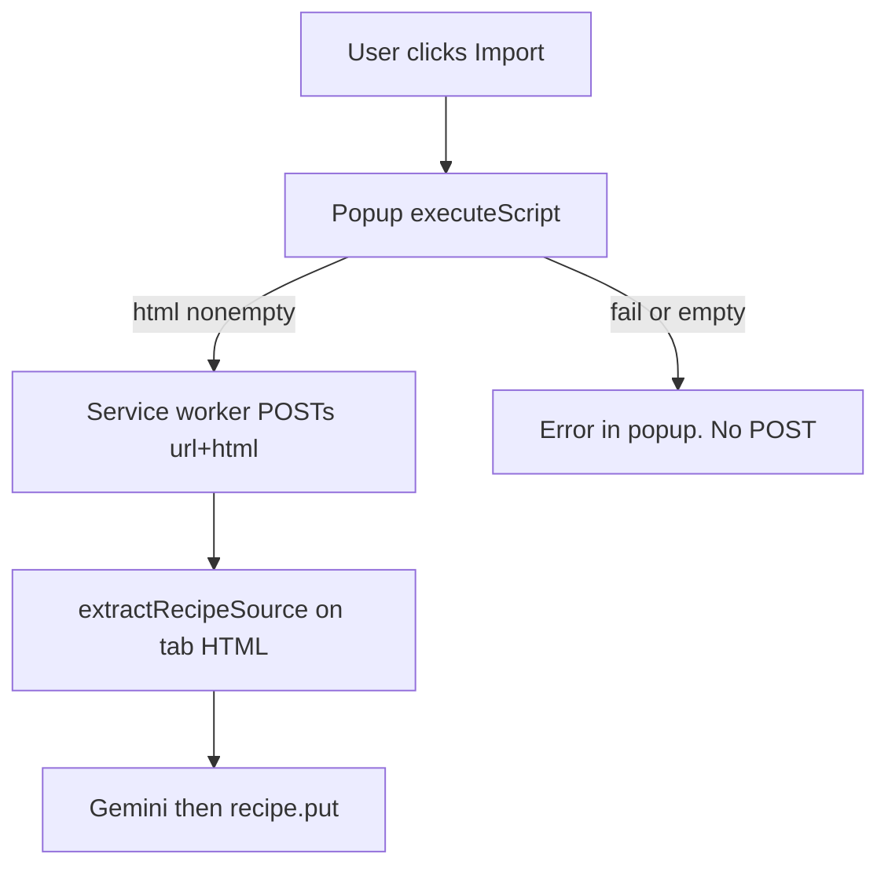

# Import blocked sites via extension HTML, not a proxy

Some recipe sites (AP News is the example) return **403** when Cloud Run
fetches them. The cause is a Cloudflare Managed Challenge
(`cf-mitigated: challenge`), not a missing User-Agent. This slice does **not**
add a proxy. It makes the Chrome extension actually send the tab HTML it
already meant to send, and it stops the server from fetching the URL when that
HTML is missing.

Parent: `docs/plans/chrome-extension-import.md` (PR #5,
`cursor/chrome-extension-import-5390`). This slice stacks on that branch.

This slice **deploys nothing**.

## Research (settled — do not reopen)

A general proxy is **not reliable**, including for the website import.

Tried against
`https://apnews.com/article/ukrainian-kapusnyak-sauerkraut-soup-recipe-2d2d6ba1504ecd91dc98b3ff79455d9f`:

- Bare `curl`, the import iPhone Safari UA, and a desktop Chrome UA: all
  **HTTP 403**, `server: cloudflare`, `cf-mitigated: challenge`.
- `r.jina.ai`: timed out.
- Google webcache: a Google Search shell, not the article.
- Wayback: a snapshot of this one URL existed. Snapshots are stale, incomplete
  for many recipes, and would leak every imported URL to a third party.

What that rules out:

- Routing Cloud Run, a Cloudflare Worker, or any other datacenter through the
  same `fetch`. The iPhone Safari UA in `api/import.ts` already does not help.
- TLS impersonation (`curl_cffi`-style): addresses JA3, not a JS challenge.
- Residential proxies + headless browsers (ScrapingBee, Browserless, Bright
  Data): a scraping stack — cost, ToS, still not 100%, new secrets and vendors.
  Out of scope for a personal allowlisted PWA.

The SPA cannot fetch the page in the user’s browser either: cross-origin
`fetch` from `localhost:5173` / `sous.kyrylo.lol` is blocked by CORS. So there
is no in-app workaround that works for AP News–class sites.

**Website import (`POST /api/import`):** keep the existing server `fetch` for
sites that allow it. On refuse (403/etc.), keep telling the user to paste the
recipe text. Do **not** add a proxy, reader service, or headless browser. Do
**not** add an `html` field to `/api/import` in this slice. Do **not** mention
the unpacked extension on `ImportScreen`.

**Chrome extension:** a real browser tab that already passed the challenge
**is** the workaround. That was Decision 3 of the parent plan. The remaining
bug is that empty HTML silently falls back to `fetchPageHtml`.

## What is wrong today

PR #5 is not URL-only in the source, but it **behaves** that way when
injection yields nothing.

`extension/background.js` injects `grabPageSource` **after** `await
resolveTargets()` (cookie lookups) and POSTs `{ url, html }`.
`server/extensionImport.ts` uses `html` when non-empty, otherwise calls
`fetchPageHtml(url)` — the same Cloud Run `fetch` that AP News 403s.

Injection is easy to miss:

- `executeScript` runs in the service worker after awaits, fire-and-forget
  from the popup message. `activeTab` is granted by opening the action; running
  the inject after awaits / from the worker is a known failure mode
  (`Cannot access contents of the page`).
- On failure, `grabFromTab` logs a warning and returns `null`. The worker
  still POSTs `html: ''`. The server then fetches. The popup shows
  `The site refused the request (403)…` — i.e. “it just sent the link.”

## Decisions (settled — do not reopen while implementing)

1. **No proxy / reader / scraping API** for `/api/import` or
   `/api/extension/import`.
2. **Extension import requires the tab’s HTML.** Empty or whitespace `html` is
   `422` `"Could not read that page."`, never `fetchPageHtml`. `fetchPageHtml`
   stays on `api/import.ts` for the website URL path only.
3. **Grab in the popup, on the Import click.** That is the `activeTab`
   user-gesture context. The worker only authenticates and POSTs. The long
   Gemini wait still belongs in the worker (parent Decision 7): popups die when
   they lose focus; grabbing the DOM is fast.
4. **Injection failure is an honest error, not a URL-only POST.** Restricted
   pages (`chrome://`, the Web Store) and a failed inject do not POST.
   Amends parent Decision 3: the server fetch fallback is removed, not kept
   for “restricted pages whose URL we know.”
5. **Website URL import is unchanged.** The existing 422 copy (“Try pasting
   the recipe text instead.”) stays.

## Starting state (read, not assumed)

- `extension/popup.html` already loads `popup.js` as `type="module"`.
- `extension/extract-page.js` exports `grabPageSource`; every helper is nested
  inside it because `executeScript({ func })` serializes via `toString()`.
- `extension/background.js` imports that grabber, injects after cookie
  lookups, and POSTs `html: (page && page.html) || ''`.
- `server/extensionImport.ts` branches: nonempty html → extract; else
  `fetchPageHtml`.
- `POST /api/import` is the website path and still fetches. Leave it.

## Steps

### 1. [core] This plan

This file. Amends parent Decision 3 as above. Add a row to the Plans table in
`AGENTS.md`.

### 2. [ui] Popup grabs the page; worker never injects

`extension/popup.js`:

- Import `grabPageSource` from `./extract-page.js`. Cap stays `400_000`.
- On **Import to Sous**, `chrome.scripting.executeScript({ target: { tabId },
  func: grabPageSource, args: [MAX_HTML_CHARS] })` **before** messaging the
  worker.
- Restricted / non-`http(s)` → write `{ phase: 'error', message: 'This page
  cannot be imported.' }` to `chrome.storage.session` and **do not POST**.
- Injection succeeded but HTML is empty/whitespace →
  `'Could not read this page.'`, no POST.
- Both error paths **render as well as store**. `storage.session` drops the
  change event when the value is byte-identical, so a second failure carrying
  the same message never reaches the `onChanged` listener and would otherwise
  leave the spinner up with every control hidden.
- Message becomes `{ type: 'import', tabId, url, html }`. Await it: a rejection
  means the worker never took the page, and since nothing has written
  `working`, the stale-run timeout cannot rescue it — surface
  `'Could not start the import.'` instead of spinning.

`extension/background.js`:

- Drop the `extract-page.js` import, `grabFromTab`, and `tabUrl`.
- `runImport(tabId, url, html)` POSTs the popup-supplied body. If the message
  is missing a nonempty `http(s)` URL or nonempty html, write the matching
  error phase and return — defense in depth, still no fetch.
- Keep origin discovery, keepalive, 90s abort, localhost-before-production,
  and “timeout is final.”

### 3. [core] Extension route: HTML required

`server/extensionImport.ts`:

- After the existing URL scheme check, if `html.trim() === ''` → `422`
  `{ error: 'Could not read that page.' }`.
- Delete the `else { fetchPageHtml(url) }` branch and the `fetchPageHtml`
  import. The URL scheme check stays: `sourceUrl` is stored on the recipe
  either way.
- `fetchPageHtml` stays on `api/import.ts`.

`server/extensionImport.test.ts`: empty and whitespace `html` (and a missing
`html` field) return 422 with a forged `X-Sous-Session`, and `fetch` is not
called. Auth and origin tests stay. Do not hit Gemini or Firestore.

### 4. [core] Docs where the parent plan is now wrong

Update `docs/plans/chrome-extension-import.md` Decision 3, the flowchart
(popup injects, worker POSTs), step 4 (`html` required), and step 6 (no
server-fetch fallback; inject lives in the popup). README: one sentence that
a tab the extension cannot read is an error, not a server-side fetch. Do not
mention a production extension install on `ImportScreen`.

## Verification

- `npx tsc -b` and `npm test`.
- Curl `POST /api/extension/import` with a forged `X-Sous-Session`: empty
  `html` → 422; do **not** call AP News from the server. A 200 with real
  Gemini + Firestore is optional and must use the emulator if it writes.
- Manual: unpacked extension on `http://localhost:5173`, signed in, import
  the AP News kapusnyak article from the live tab. Expect a saved recipe, not
  a 403. A `chrome://` tab still errors locally without a server fetch.
  Website `/import` of that same URL still 422s with the paste hint — that is
  intended.

## Non-goals

- Deploy, Web Store packaging, Firefox.
- Changing `/api/import` body shape (`url` | `text` only).
- Gemini prompt, `extractRecipeSource`, or `0x1E` chat framing.
- Privacy legal rewrite (already noted as a follow-up in the parent plan).
- A proxy, reader API, or headless browser for website import.
