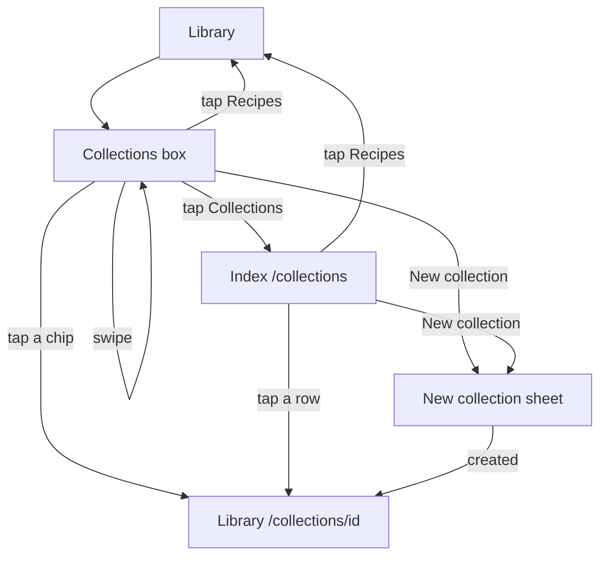

# Library collections region

UX spec. Not an implementation plan: it has no tagged steps, and nothing
here should be built until a later plan breaks it into steps.

Constitutions read: `docs/constitutions/i18n.md`,
`docs/constitutions/client-state.md`. Neither is amended. Cook log and
image import do not apply.

## What this responds to

The collection switcher sits in the same stack as search and the recipe
cards, and its chips use the same pills as recipe tags. Four treatments
were drawn (boxed section, tabs, full-width bar, label and rule), including
a collapsed “4 more” row for a long list.

Feedback on those:

- The full-width bar and the label-and-rule are out.
- The boxed section is the one to keep. Collections are a list the person
  made, or that was shared with them, so they belong in their own section.
- An accordion on tabs is an unfamiliar pattern. Do not use it.
- A long list should scroll sideways, or collections should have their own
  screen, because a disclosure does not scale.
- Show the flow, not only the resting state.

## Decision

The library gets a boxed Collections section. Names that do not fit scroll
sideways inside the box. The full list is a screen of its own. There is no
accordion and no in-place “Show less”.

Rejected:

- Tabs, with or without an accordion. A tab underline does not survive a
  wrap, and hiding tabs behind a disclosure is not a pattern people know.
- A full-width bar. It reads as app chrome, not as a list the person owns.
- A label and a rule as the whole treatment. The label row is kept, but
  only inside the box, so “New collection” is not one more name.
- Wrapping chips into the search row. That is the current problem.
- A “N more / Show less” disclosure. Opening it pushes the recipe list
  down and back, and it is the accordion pattern the review rejected.

“All collections” on the search row stays what it is today: a filter that
lists recipes from every collection. It is not the collections screen, and
the new screen must not reuse that label.

## What a collection is

A named collection is one this account created, or one someone shared with
this account. The app does not file recipes into collections by itself.
Recipes with no collection are the unfiled list, labeled Recipes, at `/`.
A named collection’s recipes stay at `/collections/<id>`.

Order of named collections stays the current one: name, then id.

## The box

Shown on `/` and on `/collections/<id>`, between the header and the search
row, whenever the library has loaded and the account has at least one
named collection. The empty case is below.

The box is a surface card with the same radius and border as a recipe
card. It has two parts.

**Label row.** Folder icon, then the existing “Collections” string
(`library.collectionsNav`). That label is a link to the index. On the
right, “New collection” (`common.newCollection`). The action is not in
the scroller, so it stays put while the names move.

**Scroller.** One horizontal row, no wrap. First chip is Recipes (`/`).
Then one chip per named collection, same shared icon and accessible name
as today. The selected chip is the current route. If that chip is outside
the scrollport, scroll it into view when the route changes. Do not reorder
to pin it.

Swipe scrolls the row. A pointer drag and a horizontal trackpad scroll do
the same. Vertical page scroll is unchanged: the row must not capture an
up or down gesture. No carousel library, no snap that paginates past a
chip, no arrows. When the row overflows, fade the trailing edge while more
chips sit past it, and the leading edge once the row is scrolled. When
every chip fits, there is no fade and the row does not scroll.

Keyboard: the chips and the label are normal tab stops. Focus inside the
scroller scrolls the focused chip into view.

## Actions on the open collection

Share, Rename, and Delete are not chips and must not join the scroller.
When the open collection is owned and named, those three controls sit on a
line inside the card, under the scroller. They open the same sheets as
today.

When the open collection is shared, the card does not grow those controls.
The existing shared sentence and Leave stay under the card, outside it.

## The index

`/collections` is the list of collections. Today that path redirects to
`/`. The redirect is removed. `/collections/:collectionId` is unchanged
and still renders the library for that collection. `/collections` and
`/collections/:collectionId` are different routes; the index is not the
library with an empty id.

The index reads `useCollections` and the recipe list. It does not fetch.
Creating, renaming, deleting, sharing, and leaving still go through the
library sheets and the existing store methods.

Screen, top to bottom:

- Back, to the library route the person came from (`/` or
  `/collections/<id>`). If they opened the index directly, Back goes to
  `/`.
- Title: Collections (`library.collectionsNav`).
- New collection, the same sheet as the box. On success, go to the new
  collection’s library route, as create does today.
- A row for Recipes: the unfiled list, route `/`.
- One row per named collection, in the same order as the scroller. The
  row shows the name, the shared icon when it is shared, and a recipe
  count. The accessible name for a shared row is the same string the chip
  uses (`library.sharedLabel` or `library.sharedByLabel`).
- Tap a row to open that library route.

The count is a new plural catalog string, added in every language in the
implementation, not before. Recipe text is not shown on this screen.

The index does not swipe, rename, share, or delete. Those stay on the
open collection. A row is only a way to switch.

## Empty

No named collections, and signed in: the library does not show the
scroller or a link to an empty index. The box is the existing empty
sentence (`library.collectionsEmpty`) and the New collection action.
Signed out, the library stays as it is today and shows no box.

## Flows

**Switch without leaving the list.** On the library, tap Dinners in the
box. The route becomes `/collections/<id>`, the Dinners chip is selected,
and the recipe list is that collection. Search, Select, and All
collections stay where they are. Tap Recipes to return to `/`.

**A long list.** The box shows the first chips and a fade. Swipe left to
bring Guests into view. The recipe list does not move. New collection is
still on the label row. Tap Collections to open the index instead of
scrolling further. The index lists Recipes and every named collection.
Tap Guests. The library opens on that collection, and the box scrolls
Guests into view.

**Create.** From the box or from the index, New collection opens the
existing sheet. Cancel closes it and changes nothing. A successful create
opens the new collection.

**Share, rename, delete.** These appear under the chips only while that
owned collection is open. They are unchanged sheets. After a delete, the
library returns home as it does today.

**Shared.** Opening a shared collection selects its chip and shows the
shared sentence and Leave under the box. Leave is the existing sheet.

**Empty.** The box is the sentence and New collection. There is no
scroller and no index link until the first collection exists.

## Copy

No new strings in this spec. The implementation will add the index’s
recipe-count plural to every catalog in `src/i18n/`, and will run the
in-context review for the library and the index before that PR. Reuse
`library.collectionsNav`, `library.recipes`, `common.newCollection`, and
the shared-chip labels. Do not reuse `library.allCollections` for the
index.

## Out of scope

- Changing create, rename, delete, share, or leave, including their
  server behavior.
- Auto-filing recipes into collections.
- Reordering collections by hand.
- Putting Share, Rename, or Delete on the index.
- The search row, Select, All collections, or the new-recipe button.
